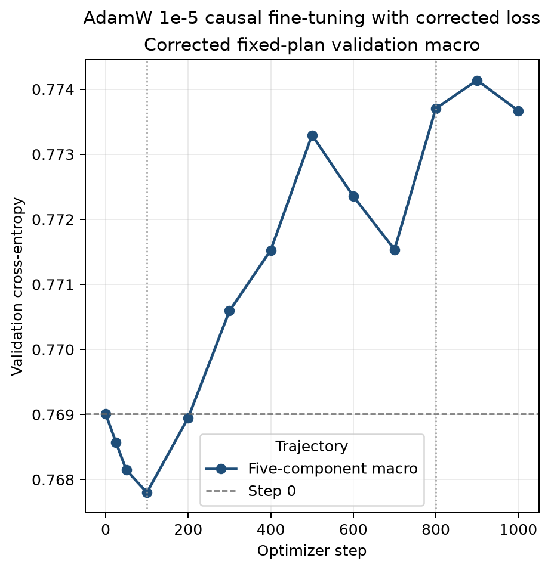
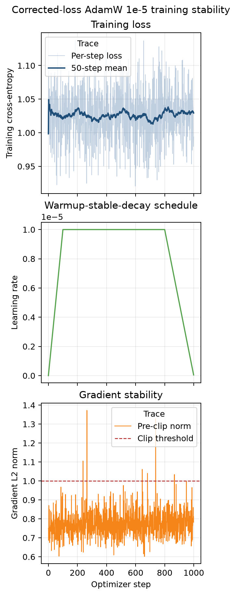
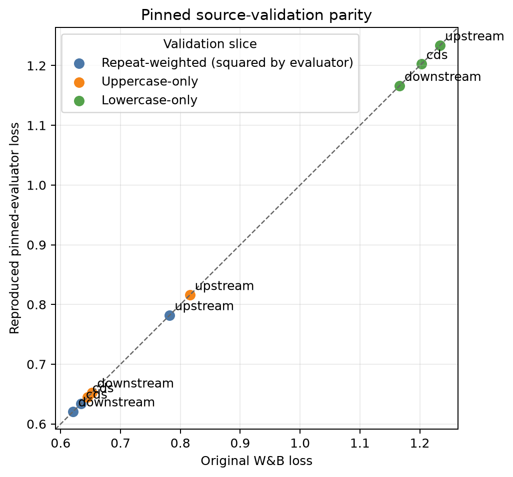

# Issue 479 MNTP adaptation result bundle

This is the compact, commit-ready result snapshot for [issue #479](https://github.com/Open-Athena/marin-dna/issues/479).
The committed figures and tables are the durable record.
W&B's composed report has been unreliable, so use the direct [pilot analysis](https://wandb.ai/gonzalobenegas/marin/runs/xe7qj1c3), [checkpoint audit](https://wandb.ai/gonzalobenegas/marin/runs/gavkgtmf), [stability audit](https://wandb.ai/gonzalobenegas/marin/runs/q67hbkp4), [final dependency](https://wandb.ai/gonzalobenegas/marin/runs/yl5sgffn), [AdamW 1e-6 calibration](https://wandb.ai/gonzalobenegas/marin/runs/q09fcejx), [superseded AdamW 1e-5 run](https://wandb.ai/gonzalobenegas/marin/runs/5lbazal6), [full source-validation reproduction](https://wandb.ai/gonzalobenegas/marin/runs/hfuhn3ta), and [corrected AdamW 1e-5 run](https://wandb.ai/gonzalobenegas/marin/runs/f77ypos4) for dense interactive views.
The corrected loss audit is at [W&B run v6mo9gh3](https://wandb.ai/gonzalobenegas/marin/runs/v6mo9gh3).

## Outcome

Every preflight gate passed, and transferred MNTP, scratch MNTP, and causal continuation each completed 1,000 finite optimizer steps on one Lambda GH200.
The standalone experiment did not use Marin or Iris.
Those three original arms optimized an incorrectly count-normalized loss that also omitted the source z-loss term.
A later 1,000-step causal replacement applied repeat weights once, normalized by effective-weight sum, and included the source z-loss.

The exact source-validation gate and corrected causal replacement are complete.
The AUPRC, context-use, coordinate, and serialization measurements are numerically unchanged, but research interpretation remains paused.

| Superseded count-normalized step-1,000 metric | Transferred MNTP | Scratch MNTP |
|---|---:|---:|
| Pooled MNTP loss | 0.397270 | 0.399543 |
| Single-mask MNTP loss | 0.310077 | 0.313152 |
| Pooled nucleotide accuracy | 0.334408 | 0.333749 |
| Single-mask nucleotide accuracy | 0.418750 | 0.396875 |

| Primary endpoint | Source CLM FWD+RC | Transferred MNTP FWD | Scratch MNTP FWD | Continued CLM FWD+RC | Transferred FWD+RC |
|---|---:|---:|---:|---:|---:|
| Mendelian macro AUPRC | 0.3951 | 0.1151 | 0.1112 | 0.3064 | 0.1152 |
| Complex-trait global AUPRC | 0.1342 | 0.1003 | 0.1018 | 0.1188 | 0.0996 |
| SGE accession/consequence macro AUPRC | 0.3577 | 0.1427 | 0.1378 | 0.3052 | 0.1429 |

Single-orientation transferred MNTP stayed within one AUPRC point of its own FWD+RC score on all three tasks, but failed the preregistered source-improvement gate on all three. It is therefore not supported as a VEP replacement from this checkpoint.

Transferred MNTP used both flanks. In the matched VEP probe set its left/right L1 responses were 0.02007/0.01988, compared with 0.02581/0.01280 for full attention without adaptation and 0.16545/0 for source CLM. Complete-flank ablation reduced score-rank correlations to 0.72–0.75, while ±64-base window shifts retained correlations of 0.991–0.993. These are mechanistic findings, not downstream gains.

## Integrity audit

A loss-path bug was found after comparison with the original Marin reducer.
Repeat-downweighted token losses were divided by raw selected-token count instead of effective-weight sum, and the source z-loss term was omitted.
Direct source scoring and zero-update save/reload were bit-exact for both strands across all 51,623 odd/X variants, so serialization did not cause the discrepancy.
The pinned source tagged evaluator had a separate reporting bug: it applied repeat weights in the per-token loss and again in its accumulator for the default mixed-case validation slices.
Source training used the ordinary single-weight reduction and included z-loss; the tagged validation callback double-weighted repeats and omitted z-loss.
Replayed CLM step 400 was bit-exact to the original Lightning checkpoint, and every replayed per-step loss matched W&B because both paths reproduced the same invalid reducer.

The sequence contract is one BOS plus 255 nucleotides, with no EOS; PAD/UNK/BOS are 0/1/2, canonical bases are 3–6, and MNTP adds MASK 7.
Both training and inference supervise nucleotide `i` from model output `i - 1`; the audit checked indices 0, 63, 127, 191, and 254 in both orientations with zero score error.
Twenty-seven independently reconstructed 0-based, half-open coordinate anchors passed.
The exp479 diagnostic panel uses 128 fixed rows from each of five probes, whereas the original source run evaluates all 16,384 rows from each of CDS, upstream, and downstream.

The high-learning-rate continued-CLM degradation was progressive rather than an immediate load/save failure.
Its registered fixed-panel values reproduce the invalid count-normalized reducer and therefore are not source-comparable absolute losses.
Mendelian FWD+RC AUPRC moved from 0.39553 at source to 0.39555 at step 1, 0.39289 at 10, 0.38241 at 100, 0.32686 at 400, 0.26384 at 800, then partially recovered to 0.30681 after cooldown.
The CLM gradient norm was mild with median 0.791 and maximum 1.263, while both MNTP arms had large but rapidly decaying clipped early transients rather than sustained instability.

One bug was found in the original dependency diagnostic, not in model training or inference: it compared a batch-one wild-type baseline with batch-1,020 substitutions, allowing BF16 batch-shape numerics to masquerade as dependency. The corrected analysis evaluates each baseline and its substitutions in the same model call. At the three step-1,000 checkpoints, transferred MNTP had past/future mean dependency 0.05314/0.05334, scratch MNTP 0.03056/0.02917, and continued CLM 0.12510/0 exactly. The CLM map's entire forbidden future triangle is exactly zero, while both MNTP maps are nonzero for every past and future position pair.

Independent full-attention final-checkpoint rechecks reproduced all raw VEP scores exactly. Causal source/continued-CLM rechecks were exact except for sparse Mendelian BF16 outliers: mean absolute error was 9.0e-6–1.7e-5 despite maxima of 0.031–0.097, and aggregate AUPRC remained consistent. This is numerical nondeterminism in a separate run, not evidence of a coordinate, tokenizer, or serialization shift.

## Conservative causal-continuation calibration

A follow-up ran one full-parameter AdamW arm for 200 steps at `1e-6` on the exact original training batches and fixed five-component validation panel.
It optimized and evaluated the invalid count-normalized objective, so its absolute losses and preregistered loss gate are superseded.

The originally reported value changed only from `0.231380263` to `0.231159212`, but that scale is not Marin-compatible.
All 200 pre-clipping gradient norms stayed below `1.0`, with a range of `0.518–0.892` and no clipped steps.
The compact historical evidence is in `causal-calibration-lr1e-6/` and at [W&B run q09fcejx](https://wandb.ai/gonzalobenegas/marin/runs/q09fcejx).
The final checkpoint upload failed only because the private Hugging Face storage limit was reached after evaluation completed.
No AUPRC evaluation or additional learning-rate arm was launched.

## Corrected audit of the one-thousand-step AdamW trajectory

The selected follow-up ran one full-parameter AdamW causal arm for 1,000 steps at peak learning rate `1e-5`.
It used 100 steps of linear warmup from zero, a constant peak through step 800, and linear decay to zero at the step-1,000 boundary.
The corrected audit evaluates the source plus all 12 retained checkpoints on the immutable 128-row panel and reports the macro over the three original source datasets.
The separate full-data gate evaluates all 16,384 rows from each original dataset and reproduces all nine historical W&B metrics.

| Step | Corrected source-three validation CE |
|---:|---:|
| 0 | 0.764633691 |
| 25 | 0.763967706 |
| 50 | 0.763849328 |
| 100 | 0.763708129 |
| 200 | 0.765367345 |
| 300 | 0.765581645 |
| 400 | 0.766916416 |
| 500 | 0.767333754 |
| 600 | 0.768070726 |
| 700 | 0.765353749 |
| 800 | 0.767562705 |
| 900 | 0.767007781 |
| 1,000 | 0.767572101 |

The corrected trajectory improves slightly during warmup and then worsens, ending `0.002938411` above the source.
The changing direction survives the denominator correction, although the 128-row panel is too small for exact source-run parity.
Direct evidence is in `loss-normalization-audit/` and at [W&B run v6mo9gh3](https://wandb.ai/gonzalobenegas/marin/runs/v6mo9gh3).

## Full source-validation parity
## Corrected causal replacement

The corrected replacement restarted from the released m5.1 checkpoint and ran full-parameter AdamW at peak `1e-5` for 1,000 steps.
It applied each repeat weight once, divided by effective-weight sum, included source z-loss during training, and reported pure validation CE as an equal macro over the five fixed 128-row components.

Macro CE was `0.769008732` at source, reached `0.767801766` at step 100, crossed above source between steps 200 and 300, peaked at `0.774135425` at step 900, and ended at `0.773670488`.
The final increase was `+0.004661756`, and cooldown recovered `0.000464937` from step 900 to 1,000.
The source value agrees with the earlier independent evaluator within `6.4e-6`.
Across all 13 checkpoints, the corrected trajectory differs from the same validation metric on the superseded run by at most `0.000136974`.



All 1,000 training-loss and gradient rows are finite.
Successive 100-step mean training losses stayed within `1.0216–1.0308`.
Pre-clipping gradient norm median/p95/maximum was `0.7674/0.8845/1.3722`, and six steps clipped.



All 13 corrected model artifacts are committed in W&B and total 67.25 GB.
The full step-1,000 Lightning artifact contains optimizer, scheduler, and loop state.
No checkpoint was deleted or uploaded to Hugging Face.
The run cost an estimated `$1.274169`, bringing the cumulative listed-price estimate to `$28.307954 / $50`.
Direct evidence is in `causal-longrun-lr1e-5-corrected/` and at [W&B f77ypos4](https://wandb.ai/gonzalobenegas/marin/runs/f77ypos4).
Research knowledge-base interpretation remains paused.


The completed 49,152-row audit reproduces the original pinned evaluator rather than assuming that its logged loss used the intended single repeat weight.
The reproduced historical macro is `0.861413936` versus `0.861344755` in W&B, a difference of `0.000069181`.
The largest absolute difference among the nine component/slice metrics is `0.000168145`, comfortably inside the unchanged `0.002` gate.
All six uppercase-only and lowercase-only metrics match directly; the three default metrics match only when the pinned evaluator's second repeat-weight multiplication is reproduced.

| Default validation slice | Corrected CE | Reproduced pinned evaluator | Original W&B |
|---|---:|---:|---:|
| CDS | 0.654052 | 0.633950 | 0.633785 |
| Upstream | 0.833346 | 0.782153 | 0.782120 |
| Downstream | 0.677935 | 0.620991 | 0.620932 |
| Nine-metric macro | 0.875663 | 0.861414 | 0.861345 |



This exact agreement across three datasets, three weighting slices, and 49,152 model rows is strong evidence against an off-by-one shift, tokenizer special-token mismatch, or different source checkpoint in this reproduction.
The corrected macro is higher because it applies the intended repeat weight once; the historical evaluator biased the macro downward by `0.014249`.
The corrected value is validation CE, while the source training objective additionally included a small z-loss term.
Direct evidence is in `source-validation-reproduction/` and at [W&B run hfuhn3ta](https://wandb.ai/gonzalobenegas/marin/runs/hfuhn3ta).

All 1,000 recorded training and gradient values were finite.
Pre-clipping gradient norm had median/p95/maximum `0.6599/0.7577/1.3261`, with only two clipped steps.
Neither clipped step coincided with a loss spike, and 100-step training-loss means stayed within `0.8696–0.8827`.
The validation degradation is therefore smooth and mild rather than an optimization instability.

Twelve trajectory exports and the full step-1,000 optimizer-bearing Lightning checkpoint are retained as 13 W&B model artifacts totaling 67.25 GB.
The complete artifact identifiers are in `causal-longrun-lr1e-5/retention-manifest.json`.
No retained checkpoint was deleted and no output was uploaded to Hugging Face.

This superseded run cost an estimated `$0.8613`; the subsequent corrected audits brought the listed-price total to `$27.0338 / $50` before the corrected causal replacement.
The Lambda cluster self-terminated and was confirmed absent.
The compact evidence is in `causal-longrun-lr1e-5/` and at [W&B run 5lbazal6](https://wandb.ai/gonzalobenegas/marin/runs/5lbazal6).
Research knowledge-base interpretation remains paused.

The current conservative listed-price estimate is $28.3080 against the $50 cap.
It includes all failed, recovery, training, primary evaluation, audit, stability, cancelled exhaustive diagnostic, focused final-checkpoint, AdamW calibration, and 1,000-step AdamW attempts.
The final Lambda cluster was confirmed terminated.
Provider billing may differ from this pre-autodown list-price estimate.

## Contents

- `training-validation.csv`: reconstructed clean 100-step validation and context trajectory from the registered W&B runs.
- `primary-endpoints.csv`: preregistered headline AUPRC values and standard errors.
- `single-orientation-decision.csv`: task-level single-orientation gates.
- `strand-consistency.csv`: transferred FWD-versus-RC score correlations.
- `context-window-primary.csv`: post-hoc fixed context/window primary endpoints.
- `cost-summary.csv`: current conservative list-price accounting.
- `vep/`: compact metrics, natural-unit paired uncertainty, context probes, runtime, and manifest. Per-variant scores remain in private staging and W&B.
- `context-window/`: compact post-hoc ablation/window metrics, stability, runtime, and manifest. Per-variant scores remain private.
- `nucleotide-dependency/`: five reviewed SVG maps and their numeric summary. The HBA1 chromosome-16 reference sequence is unlabeled; no held-out label or effect measurement was used.
- `audit/`: checkpoint loss/AUPRC trajectories, alignment and coordinate contracts, three-arm gradient stability, exact/near-exact parity tables, and the corrected three-final-checkpoint dependency figure. The older five-locus dependency maps are retained as historical artifacts but must not be used quantitatively because their baseline batch shape was mismatched.
- `causal-calibration-lr1e-6/`: fixed-plan causal validation trajectory, per-component gate table, 200-step training loss and gradient trace, runtime, and cost evidence for the conservative AdamW arm.
- `causal-longrun-lr1e-5/`: pooled 1,000-step causal validation trajectory, dense training/gradient trace, retained-checkpoint manifest, runtime, cost, and reviewed SVG/PNG figures for the selected AdamW arm.
- `loss-normalization-audit/`: corrected three-source and five-probe trajectories, source-reducer scale comparison, component table, and manifest for all retained AdamW checkpoints.
- `causal-longrun-lr1e-5-corrected/`: exact five-component macro trajectory, dense training/gradient trace, final teardown cost, 13-artifact retention manifest, and reviewed SVG/PNG figures for the corrected AdamW replacement.
- `source-validation-reproduction/`: passing full-data nine-metric parity table, corrected loss values, summary, manifest, and reviewed SVG/PNG parity figure.
- `source-validation-reproduction-v0-failed/`: retained first-gate evidence that localized the pinned evaluator's second repeat-weight multiplication.
- `runs/`: arm runtime/manifests, data/preflight records, budget projection, and final cost estimate.
- `figures/`: decision-oriented SVG figures generated by `plot_results.py`.

## Provenance and boundary

- Experiment/diagnostics code: `97a6e3c50080005ad4f93f2206c4155b8f5cb7b9`; integrity-audit code: `issue-479-mntp-pilot-audited-result`; corrected causal code: `42fc993e3245a0f6a1c1d77813b0665ef56e68e5`.
- Source model: `marin-dna/marin-dna-exp135-m5.1@a73a5dcfb3d64b8941e7e7596c6e88ef77db3e7a`.
- Final model/checkpoint staging: private `gonzalobenegas/marin-dna-exp479-mntp-m5.1-spillover`; earlier transferred checkpoints remain in private `marin-dna/marin-dna-exp479-mntp-m5.1`.
- Hardware: one Lambda GH200 96 GB at a checked list price of $2.29/hour.
- Exposure per trained arm: 16,384,000 model tokens and 16,320,000 nucleotide bases at batch 64.
- Labeled development/evaluation: only odd autosomes and chromosome X. No even-autosome or Y labels, predictions, effect measurements, or aggregate metrics were accessed.
- Context-window parameterization was fixed after primary results and is explicitly non-gating.
- One seed was run. Negative VEP does not answer whether longer adaptation or supervised sequence-to-function training can benefit from the representation.

Regenerate the figures from the experiment environment:

```bash
cd experiments/exp479_mntp_adaptation
uv run --locked python ../../.agents/artifacts/479-mntp-adaptation/plot_results.py
```
