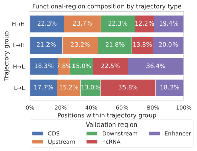
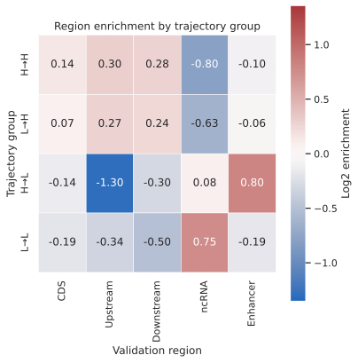
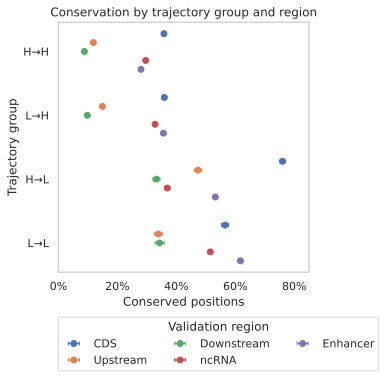
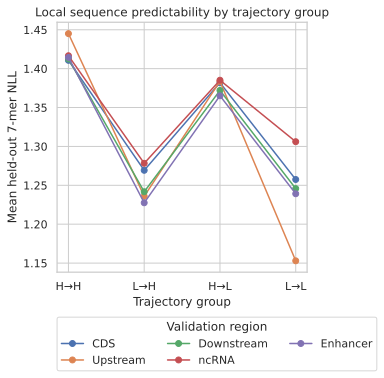
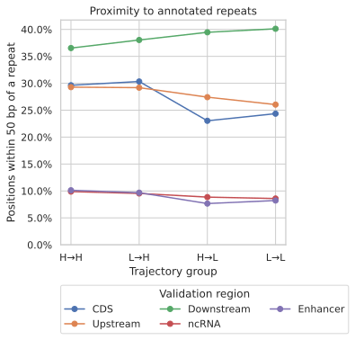

# Biological characterization of global trajectory groups

This exploratory extension characterizes the four globally fitted loss-trajectory groups from issue #489.
It uses the same 14,002,032-position primary population: target positions `[32, 223)`, scorable, nonambiguous, and nonrepeat.

## Group definition

For each position, ordinary least squares fits NLL against cumulative training tokens across all five checkpoints.
The fitted loss at the first and terminal checkpoint is compared with the corresponding global fitted mean, 1.1529 and 0.9695 nats/base.
These two comparisons define H-to-H, L-to-H, H-to-L, and L-to-L.
This is a scale-adaptive Rho-1-inspired grouping, not Rho-1's absolute `0.2`-NLL-change rule.

## Region composition

The table reports the percentage of each region assigned to each group.

| Region | H-to-H | L-to-H | H-to-L | L-to-L |
| --- | ---: | ---: | ---: | ---: |
| CDS | 46.6% | 15.4% | 9.0% | 28.9% |
| Upstream | 52.1% | 17.7% | 4.1% | 26.2% |
| Downstream | 51.2% | 17.3% | 8.1% | 23.4% |
| ncRNA | 24.3% | 9.5% | 10.6% | 55.7% |
| Enhancer | 39.4% | 14.1% | 17.4% | 29.1% |

The complementary within-group view shows the functional-region mixture of each trajectory class.
H-to-L is 36.4% enhancer and 22.5% ncRNA, while L-to-L is 35.8% ncRNA.
H-to-H and L-to-H have similar, more even region mixtures.

Relative to the primary population's region mixture, L-to-L is enriched 1.68-fold in ncRNA (`log2 = 0.75`).
H-to-L is enriched 1.75-fold in enhancer (`log2 = 0.80`) and depleted 2.46-fold upstream (`log2 = -1.30`).
H-to-H is enriched upstream and downstream and depleted in ncRNA.

## Conservation

Terminal-low groups are much more often conserved than terminal-high groups in the mixed global aggregate.
Conservation prevalence is 50.3% for H-to-L, 49.4% for L-to-L, 24.9% for L-to-H, and 21.8% for H-to-H.
The global values mix the 241-way definition used by CDS, upstream, and downstream with the 447-mammal definition used by ncRNA and enhancer, so comparisons should be made within region.

Within CDS, conservation prevalence is 76.0% for H-to-L and 56.5% for L-to-L, compared with 35.8% for H-to-H.
Within enhancer, prevalence is 53.2% for H-to-L and 61.7% for L-to-L, compared with 28.0% for H-to-H.
Within ncRNA, L-to-L reaches 51.5%, compared with 29.6% for H-to-H.
Intervals in the figure are 95% bootstrap intervals over region-specific 10 Mb genomic blocks with 2,000 replicates and seed 48910.

## Sequence predictability and annotated repeats

The held-out strand-averaged 7-mer model assigns lower mean NLL to both early-low groups in every region.
Globally, mean 7-mer NLL is 1.254 for L-to-L and 1.248 for L-to-H, compared with 1.375 for H-to-L and 1.421 for H-to-H.
This supports local sequence predictability as one contributor to low initial model loss.

Annotated-repeat proximity does not explain the global L-to-L group.
Only 18.1% of L-to-L positions are within 50 bp of a soft-masked repeat, compared with 24.9% of H-to-H and 24.7% of L-to-H positions.
The same direction holds in CDS, upstream, ncRNA, and enhancer.
Downstream is the exception: 40.1% of L-to-L positions are within 50 bp, compared with 36.5% of H-to-H positions.

## Reproducible sample inspection

The sample contains the three lowest pseudorandom priorities in every region-by-group cell, for 60 positions total and seed 48910.
Exact 61 bp contexts come from the pinned validation metadata.
The exploratory annotation pass maps primary-chromosome coordinates to UCSC hg38 and queries RepeatMasker, Tandem Repeats Finder, genomic segmental duplications, and NCBI RefSeq through the [UCSC REST API](https://genome.ucsc.edu/goldenPath/help/api.html).
All coordinates remain 0-based and half-open at that API boundary.

None of the 15 sampled L-to-L positions overlaps the UCSC RepeatMasker or simple-repeat track.
Two sampled L-to-L ncRNA positions overlap the segmental-duplication track, compared with zero H-to-H samples and one sample in each moving group.
The sample is too small to estimate population rates.

The L-to-L examples include coding positions in `DBR1`, `OR1L6`, and `CAMSAP3`; upstream positions near `H1-6`, `TEX53`, and `H3C10`; downstream positions near `NR2E3`, `TMSB4X`, and `ZNF335`; ncRNA-panel positions including one overlapping `TUBA1C`; and conserved enhancer-panel positions near `ENOX1` and `ADGRL3`.
Several upstream and downstream samples overlap RefSeq transcripts, so these validation-region labels should be interpreted as dataset-construction relationships rather than mutually exclusive genome annotations.

## Current hypotheses

- `LD489-H5`: Conservation contributes strongly to terminal-low membership, especially H-to-L in CDS and L-to-L in enhancer and ncRNA.
- `LD489-H6`: Region identity contributes independently to trajectory membership, with ncRNA enriched for L-to-L and enhancer enriched for H-to-L.
- `LD489-H7`: Local sequence predictability contributes to early-low membership because both L-to-H and L-to-L have lower held-out 7-mer NLL in every region.
- `LD489-H8`: Proximity to annotated repeats is not the main source of L-to-L membership; downstream repeat boundaries may define a region-specific exception.
- `LD489-H9`: Segmental duplication, gene-family redundancy, or other unannotated genomic redundancy may explain a minority of L-to-L positions and requires a full-population independent mappability or self-alignment test.
- `LD489-H10`: A controlled multinomial or one-versus-rest trajectory model should separate conservation, region, GC, 7-mer NLL, repeat proximity, and target position before attaching a biological interpretation to the groups.

## Files and reproduction

- `region_group_statistics.parquet` and `.csv` contain exact counts, composition, conservation, GC, 7-mer NLL, and repeat-proximity summaries.
- `trajectory_group_samples.parquet` and `.csv` contain the reproducible balanced sample.
- `trajectory_group_samples_inspected.parquet` and `.csv` add exact sequence context and exploratory UCSC annotations.
- `trajectory_region_composition.svg` shows the five-region composition within each trajectory group.
- [`biological_characterization_489.py`](../biological_characterization_489.py) performs the bounded atom reduction.
- [`inspect_trajectory_samples_489.py`](../inspect_trajectory_samples_489.py) performs the sampled context inspection.
- [`plot_biological_characterization_489.py`](../plot_biological_characterization_489.py) renders the figures.

Run the reducers from `snakemake/analysis/evals_v2` with its locked environment.
The full characterization streams one Parquet row group at a time and completed locally in 60 seconds at 454,676 KiB peak RSS.
The UCSC sample inspection completed in 22 seconds at 215,504 KiB peak RSS.

## Limits

The same five losses define group membership and the plotted trajectories, so regression to the mean and selection-induced separation remain possible.
The four groups are descriptive categories and do not establish causal training value.
The validation regions are sampled panels rather than a genome-wide census.
The UCSC annotation pass is exploratory and uses a separate hg38 annotation source after explicit primary-chromosome name mapping.
The requested mappability comparison is still open because the attempted legacy 100-mer track name was not available through the current REST endpoint.
