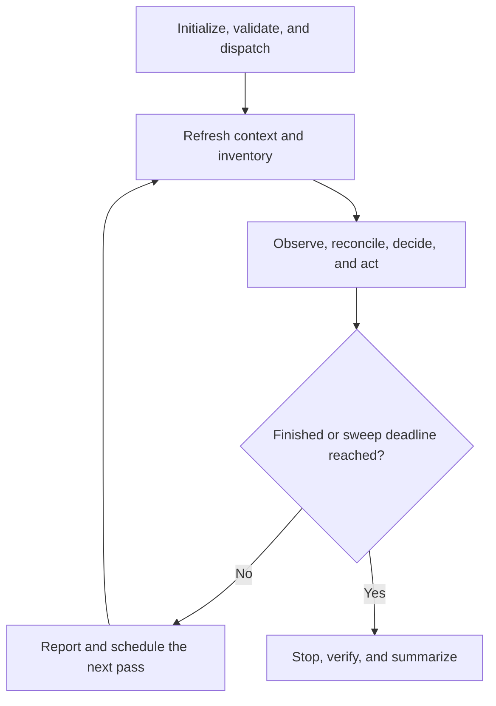

# Run Google TPU Training Sweep

Finish the declared sweep as fast as possible without violating its operations document.

Optimize global preemptible TPU capacity.
Iris handles preemptions; do not replace a dispatch for a preemption alone—act from W&B progress and the recovery policy.

## Contract

- Treat each experiment-defined configuration as an opaque logical trial.
- Let the training code own configuration and training semantics.
  Assume standard W&B training fields; inspect code for launch, data, and checkpoint behavior.
- Own only validation, placement, dispatch, monitoring, recovery, regional racing, accounting, and reporting.
- Never generate configurations or decide experimental convergence.
- Compose with `marin-experiment` for project setup, coherent Marin and Iris versions, snapshots, and launch authorization.
  This skill does not authorize remote compute by itself.
- Follow `wandb-reporting` for MarinDNA run, group, and project naming.
- Do not move a trial between accelerator families unless the operator explicitly allows it.
  Persist and report the resulting hardware lineage as a reproducibility caveat.

## State

Keep each durable fact in one authoritative form:

- **Operations (tracked text):** policy, choices, constraints, exceptions, recovery location, and operating conclusions not reliably recovered from code or data.
- **Experiment and helper code:** executable behavior.
- **SQLite (data):** structured observations, identities, attempts, action results, clocks, and history.
- **Immutable SQLite backups:** recoverable copies under the experiment's durable owner selected with `manage-research-storage`.
- **Task logbook:** research chronology, decisions, milestones, and handoff context under `task-logbook` or `run-research`.

Session chat is the interface, not state.
Put heartbeat reports and decisions needing operator input there.
Anything needed by a later heartbeat belongs in text, code, or data.

Never restate code or configuration in Operations; prefer a source reference.
Do not create a second operational status file or copy SQLite state into the logbook.
The logbook remains required when `task-logbook` or `run-research` applies and records research chronology rather than fleet-control state.

## Process

Read every reference in this table before setup.
It assigns ownership; later sections define the phase contracts.

| Phase | Purpose | Detailed references |
| --- | --- | --- |
| Initialize | Gather choices and establish durable state | [operations.md](references/operations.md), [targets.md](references/targets.md), [persistence.md](references/persistence.md) |
| Validate | Establish safe regional targets and launch behavior | [validation.md](references/validation.md) |
| Operate | Observe, place, recover, report, and schedule | [execution.md](references/execution.md), [throughput.md](references/throughput.md), [persistence.md](references/persistence.md) |
| Finish | Verify completion, checkpoints, and integrity | [throughput.md](references/throughput.md), [persistence.md](references/persistence.md) |

Use [utilization.md](references/utilization.md) only for optional placement hints.
Investigate utilization failures when useful, but continue without that hint.



## Initialize

### Interview Briefly

Ask only for missing information.
Offer the recommended answer first.

1. **Training entry point and trial catalog.**
   Require both.
2. **Sweep deadline.**
   Recommend two weeks.
   Explain that this is the hard stop for the entire sweep, not a recovery timeout.
   Use `reslice_after`, `restart_after`, and `relocate_after` for faster recovery; shortening the deadline may leave trials unfinished.
3. **Regional replicas per trial.**
   Recommend `1`; explain `2` often reduces completion time but duplicates work.
   Discourage more than `2`.
4. **Compute and TPU scope.**
   Require an explicitly approved remote-compute scope and overall chip limit before any smoke or production dispatch.
   Recommend the limit from the training code and prior runs.
   Default the target scope to every 4–16-chip TPU in all otherwise allowed regions.
   Accept plain-English scopes or exclusions such as “training chips only,” “4–16-chip inference TPUs in `euw4`,” or “32+-chip TPUs in any region.”
   Recommend keeping cross-family reslicing disabled unless throughput outweighs the reproducibility cost.
5. **Sweep timing.**
   Recommend `heartbeat_every=30m`, `reslice_after=1h`, `restart_after=3h`, and `relocate_after=3d`.
   Explain that they define the major scheduled behavior to expect and should remain unchanged without a concrete reason.
   Ask whether to use the defaults.
6. **Durable state owner.**
   Require an exact durable object-store prefix and upload/download method before dispatch.
   Recommend the Marin experiment's native object-store ownership under `manage-research-storage`.
   Use issue-owned storage only when the sweep already has a coordinating issue; this skill does not create one merely to store state.

Create the document from [operations.md](references/operations.md) as a tracked file beside the experiment project.
Build its candidate grid from [targets.md](references/targets.md), record the durable state prefix and recovery procedure, then initialize the local SQLite working copy:

```bash
uv run .agents/skills/run-training-sweep-trc/scripts/persistence.py \
  init scratch/<sweep>/expXXX_sweep.sqlite
```

Create a consistent backup with the helper and upload it to a new immutable key under the recorded durable prefix before the first dispatch.
Record research setup and milestones through `task-logbook` or `run-research` when either applies.

## Validate

Follow [validation.md](references/validation.md) before the first dispatch.
Validate the experiment entry point, regional inputs and checkpoints, target compatibility, W&B observation, and Iris submission.
Submit only `eligible` targets and show the first assembled dispatch command to the operator.

## Operate

Run each heartbeat as a complete agent decision pass.
Helpers may calculate or render facts; they may not choose or perform actions.
Never delegate decisions to a monitor, dispatcher, scheduled loop, or recovery script.

At every heartbeat:

1. **Refresh context and inventory:** enter from authoritative state, not memory.
   Restore the newest valid immutable SQLite backup when the local working copy is absent, reread Operations and relevant code, then build the inventory snapshot.
   Reconcile every `dispatch_intent_unreconciled` against its exact Iris job before any other action.
2. **Observe, reconcile, decide, and act:** establish what is progressing before changing anything.
   Query W&B first, use Iris only as allowed, persist observations, and rebuild the decision snapshot.
   Protect recent progress, resolve exceptions, reconsider every dispatch, and coordinate one fleet plan with [execution.md](references/execution.md).
   Persist each result and revise the plan when an action changes material facts.
   After every state-changing transaction, publish a consistent immutable backup before another external action or handoff.
3. **Finish or continue:** if finished or the sweep deadline has arrived, stop, verify, and summarize.
   Otherwise report in chat and schedule exactly one next pass for `heartbeat_every`, using the environment's supported time-based task or thread wakeup mechanism.
   Never rely on event-based monitoring.

Build the inventory and decision snapshots with:

```bash
uv run .agents/skills/run-training-sweep-trc/scripts/persistence.py \
  snapshot scratch/<sweep>/expXXX_sweep.sqlite --reslice-after-hours <hours>
```

Rebuild after material actions when needed.
A snapshot is an ephemeral, decision-complete projection, not another status record.
It covers every unfinished trial and actionable condition while summarizing stable history.
Query raw history only for a specific decision.

## Finish

A trial finishes when `run_progress >= 1` and the expected checkpoint is reachable.
W&B `finished` alone is insufficient.

When every trial finishes or the sweep deadline arrives, stop remaining dispatches, verify completion and checkpoints, check SQLite integrity, and report the outcome as defined by [throughput.md](references/throughput.md).
Include the accelerator and placement lineage for every trial that moved across hardware families.
Do not schedule another pass.
Publish one final immutable SQLite backup and link it from the logbook or coordinating issue/PR.
