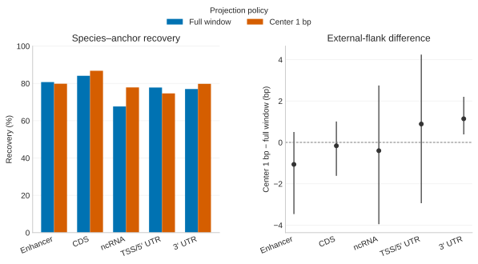
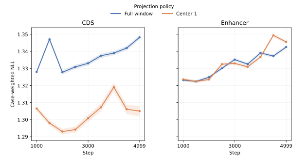
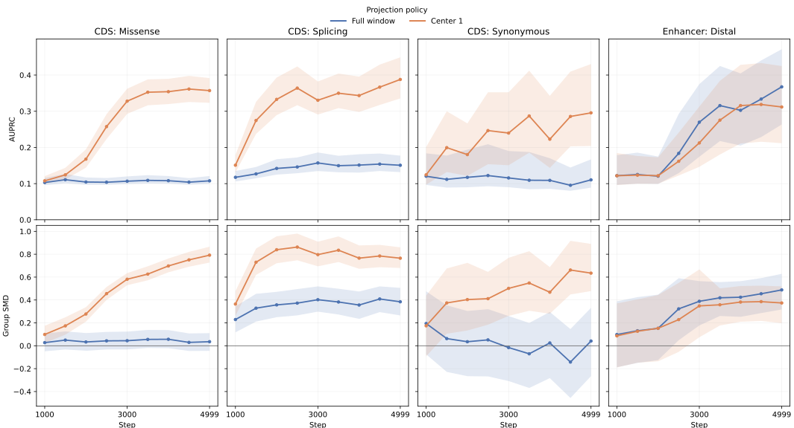
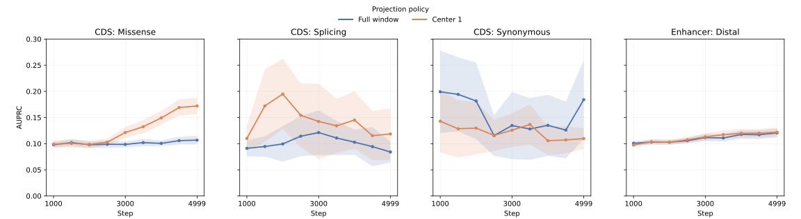
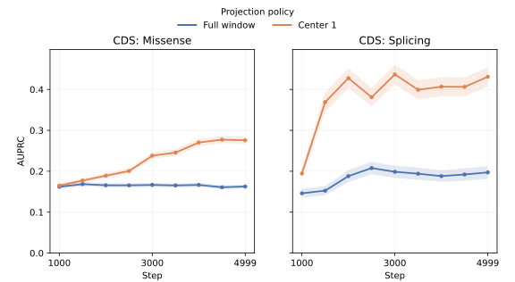

# Center-seeded projection for vertebrate training data

> [!NOTE]
> **TL;DR:** In one matched-token seed evaluated on development data, center-1 produced higher CDS Mendelian AUPRC and lower shared-row loss than full-window projection, while full-window produced higher distal enhancer Mendelian AUPRC. These exploratory results support center-1 for CDS and full-window for enhancer-centered cCREs for this training recipe.

## Findings

Center-seeded projection does not create a universal recovery advantage.
Relative to full-window projection, it recovered 2.679 percentage points more CDS species-anchor pairs and 10.208 points more ncRNA-exon pairs, but 0.892 points fewer enhancer-centered cCRE pairs and 3.135 points fewer TSS/5′-UTR pairs.
CDS recovery improved in every audited clade, whereas enhancer recovery declined in every clade.
Both policies still reached jawless vertebrates.

The sampled reverse-trace audit did not support the proposed mechanism that center-1 generally sacrifices aligned anchor coverage or adds external flank.
Every region's paired aligned-coverage interval included zero.
Only UTR3 had a nonzero external-flank difference, with center-1 adding 1.143 bases on average.

Downstream results separate CDS from enhancers more sharply than projection yield does.

At step 4,999, center-1 improved CDS Mendelian AUPRC by 0.249 for missense, 0.237 for splicing, and 0.185 for synonymous variants.
All three paired intervals excluded zero.
The corresponding Group SMD differences were also positive, and CDS center-1 had lower case-weighted NLL on the exact shared chromosome-18 projection rows at every checkpoint.

Enhancer center-1 did not show the same benefit.
Its terminal distal Mendelian AUPRC was 0.056 lower, with an interval excluding zero.
Distal Complex AUPRC point estimates differed by +0.0015 center-minus-full, compared with official SEs of 0.0084 and 0.0086; no paired policy-difference interval or equivalence test was available.
The shared-row loss trajectory changed sign across checkpoints.

For this training recipe, the one-seed development evidence supports center-1 for CDS projection and full-window projection for enhancer-centered cCREs.
All eight relevant Mendelian metric/subset cells triggered the preregistered additional-seed evidence gate, so this recommendation remains exploratory.
Other regions require matched downstream comparisons, and this evidence does not warrant a wider projection-policy pilot.

## Evidence

### Projection QC

The producer completed all 135 projection partitions and the deterministic sample trace completed all 645 trace jobs.
The accepted union contains 74,524,203 species-anchor rows.
All emitted intervals are 255 bp, all coordinates are in bounds, and chromosome/strand agreement is exact.
The median projected-center displacement is 3 bp.

_Projection QC by region. Left: exact recovery over all requested species–anchor pairs. Right: the policy-specific mean emitted-window-to-anchor aligned fraction in the exact sampled HAL traces; error bars are normal 95% confidence intervals over human anchors. Paired policy differences and anchor-bootstrap intervals are tabulated below._

| Region | Full window | Center 1 | Difference |
|---|---:|---:|---:|
| Enhancer-centered cCRE | 80.72% | 79.83% | -0.892 pp |
| CDS | 84.10% | 86.78% | +2.679 pp |
| ncRNA exon | 67.64% | 77.85% | +10.208 pp |
| TSS / 5′ UTR | 77.80% | 74.66% | -3.135 pp |
| 3′ UTR | 76.99% | 79.76% | +2.766 pp |

_Species-anchor recovery on the fixed human anchors. Across all five regions, recovery was 79.60% for full window and 82.28% for center-1._

The 5,328-row named-PSL sample reproduced every producer aligned-base count exactly.
Uncertainty used 1,000 bootstrap draws over human anchors.

| Region | Aligned-coverage difference | 95% interval | Anchors | External-flank difference | 95% interval | Anchors |
|---|---:|---:|---:|---:|---:|---:|
| Enhancer-centered cCRE | +0.00433 | [-0.00480, 0.01345] | 102 | -1.063 bp | [-3.465, 0.502] | 102 |
| CDS | +0.00040 | [-0.00312, 0.00393] | 214 | -0.163 bp | [-1.617, 1.010] | 209 |
| ncRNA exon | +0.00484 | [-0.00231, 0.01200] | 51 | -0.400 bp | [-3.952, 2.750] | 40 |
| TSS / 5′ UTR | +0.00580 | [-0.01104, 0.02264] | 46 | +0.889 bp | [-2.938, 4.245] | 45 |
| 3′ UTR | +0.00080 | [-0.01044, 0.01205] | 49 | +1.143 bp | [0.387, 2.204] | 49 |

_Paired center-1 minus full-window mean aligned-to-anchor fraction and total external-flank bases among the sampled traces._

Two examples make the policy difference concrete:

- CDS anchor `win_chr10_000116477` in *Dinomys branickii* maps both policies to `DinBra_scaffold_14185` on the plus strand. Full window uses four fragments and emits `[89487, 89742)`; center-1 uses one fragment and emits `[89485, 89740)`. Both retain 249 aligned anchor bases and three internal unaligned bases.
- Enhancer anchor `enh_001515628` in *Craseonycteris thonglongyai* is rejected by full window because 11 fragments span five scaffolds. Center-1 accepts the unique center locus at `CraTho_scaffold_257521:[922,1177)` on the plus strand, with 250 aligned anchor bases and an aligned center nucleotide.

### Matched training

All four arms used the same 40,960,000 training sequences and 10,485,760,000 tokens.
The exact issue-417 CDS full-window arm was reused; it was not retrained.
The other three arms were trained through step 4,999.

| Region | Policy | Training rows | Effective epochs | Run |
|---|---|---:|---:|---|
| CDS | Full window | 66,552,602 | 0.615 | Reused from #417 |
| CDS | Center 1 | 68,657,166 | 0.597 | New |
| Enhancer | Full window | 24,889,396 | 1.646 | New |
| Enhancer | Center 1 | 24,616,580 | 1.664 | New |

The public W&B runs are linked below.

### Shared-row validation loss

_Actual case-weighted NLL on identical chromosome-18 projected rows; bands are 95% human-anchor bootstrap intervals. Lower is better. This uses unlabeled projection sequence as a fit diagnostic, not held-out variant-effect labels._

At step 4,999, center-1 minus full-window case-weighted NLL was -0.04323 [-0.04614, -0.04038] for CDS.
The difference favored center-1 at every checkpoint.
For enhancers it was +0.002955 [0.002476, 0.003452], but the trajectory changed sign across checkpoints.

### Development evaluation

Every arm was evaluated at steps 1,000 through 4,500 in 500-step increments and at step 4,999.
The complete matrix contains 90 score artifacts and 90 official metric artifacts.
Only region-relevant subsets are presented here: missense, splicing, and synonymous for CDS; distal for enhancers.

_Actual Mendelian development metrics from one training seed. Rows show AUPRC and Group SMD; columns show the four region-relevant subsets. Bands are paired 95% match-group bootstrap intervals._

| Region | Subset | Metric | Full window | Center 1 | Difference | Paired 95% interval |
|---|---|---|---:|---:|---:|---:|
| CDS | Missense | AUPRC | 0.108 | 0.357 | +0.249 | [0.213, 0.285] |
| CDS | Missense | Group SMD | 0.035 | 0.792 | +0.756 | [0.653, 0.862] |
| CDS | Splicing | AUPRC | 0.151 | 0.388 | +0.237 | [0.184, 0.295] |
| CDS | Splicing | Group SMD | 0.384 | 0.765 | +0.381 | [0.266, 0.493] |
| CDS | Synonymous | AUPRC | 0.110 | 0.296 | +0.185 | [0.079, 0.308] |
| CDS | Synonymous | Group SMD | 0.041 | 0.635 | +0.594 | [0.299, 0.977] |
| Enhancer | Distal | AUPRC | 0.367 | 0.312 | -0.056 | [-0.100, -0.016] |
| Enhancer | Distal | Group SMD | 0.488 | 0.374 | -0.114 | [-0.186, -0.058] |

_Terminal Mendelian development metrics. Positive differences favor center-1; uncertainty uses 1,000 aligned match-group bootstrap draws._

Complex uses the official `abs_llr_avg` AUPRC.

_Actual Complex-trait development AUPRC using the official `abs_llr_avg` score. Bands show ±1 official bootstrap SE; a paired policy-difference interval was not available._

SGE uses official assay-macro `minus_llr_avg` AUPRC and has relevant endpoints for CDS missense and splicing variants.

_Actual SGE development assay-macro AUPRC using the official `minus_llr_avg` score. Bands show ±1 official bootstrap SE; a paired policy-difference interval was not available. Enhancer checkpoints were not submitted because this benchmark has no region-relevant enhancer endpoint._

| Region | Dataset | Subset | Full window | Center 1 | Difference |
|---|---|---|---:|---:|---:|
| CDS | Complex | Missense | 0.1068 ± 0.0082 | 0.1721 ± 0.0155 | +0.0653 |
| CDS | Complex | Splicing | 0.0841 ± 0.0203 | 0.1186 ± 0.0495 | +0.0345 |
| CDS | Complex | Synonymous | 0.1841 ± 0.0753 | 0.1097 ± 0.0197 | -0.0744 |
| CDS | SGE | Missense | 0.1627 ± 0.0049 | 0.2757 ± 0.0086 | +0.1131 |
| CDS | SGE | Splicing | 0.1971 ± 0.0155 | 0.4308 ± 0.0234 | +0.2337 |
| Enhancer | Complex | Distal | 0.1205 ± 0.0084 | 0.1220 ± 0.0086 | +0.0015 |

### Reproducibility

- Projection QC bundle: `s3://oa-bolinas/snakemake/analysis/issue473/results/ff8aaa8a8479e074751264c880d7034167a1654d/d0e5380a46cd66d4c42d763b3c42da1150c92073/bf8367c285f955407cfb2dba6102661b2e528261b64fe52095d52a688cd6d039/projection_report_v3/`
- Sample flank trace: `s3://oa-bolinas/snakemake/analysis/issue473/results/a2026df5c995d4e008884952511f2d344ee63130/d0e5380a46cd66d4c42d763b3c42da1150c92073/bf8367c285f955407cfb2dba6102661b2e528261b64fe52095d52a688cd6d039/trace_flanks_v1/`
- Final development analysis: `s3://oa-bolinas/snakemake/analysis/evals_v2/results/issue473/ae90f6d9e4b23ebe8fb1bd2314baa66cb82b37c1/analysis/89bcd07baf27d0326bf6efbbf101c6204fb0a7db/`
- Shared-row loss analysis: `s3://oa-bolinas/snakemake/analysis/evals_v2/results/issue473/ae90f6d9e4b23ebe8fb1bd2314baa66cb82b37c1/intersection_loss/`
- Public datasets: [CDS center-1](https://huggingface.co/datasets/marin-dna/vertebrate-v1-issue473-center1-cds/tree/4d9a04ab6c4a6e445345fe35fbe2be41b43e7938), [enhancer full window](https://huggingface.co/datasets/marin-dna/vertebrate-v1-issue473-fullwindow-ccre-enhancer-centered/tree/ffb9c63fae72311fb457640af9c8365b84f0edf8), and [enhancer center-1](https://huggingface.co/datasets/marin-dna/vertebrate-v1-issue473-center1-ccre-enhancer-centered/tree/23d1531f63998b5716e7895a74437e0568186bd1).
- Public W&B runs: [CDS center-1](https://wandb.ai/gonzalobenegas/marin/runs/dna-exp473-0p25b-cds_center_1-v1), [enhancer full window](https://wandb.ai/gonzalobenegas/marin/runs/dna-exp473-0p25b-enhancer_full_window-v1), and [enhancer center-1](https://wandb.ai/gonzalobenegas/marin/runs/dna-exp473-0p25b-enhancer_center_1-v1).
- Analysis snapshot: `89bcd07baf27d0326bf6efbbf101c6204fb0a7db`; experiment identity: `ae90f6d9e4b23ebe8fb1bd2314baa66cb82b37c1`.

All evaluation data came from the official public `evals_v2` `train.parquet` files.
No held-out even-autosome or chromosome-Y label, prediction, effect measurement, or aggregate metric was requested or read.
Enhancer checkpoints were not submitted to SGE.
All internal genomic coordinates are 0-based and half-open.

## Limitations

- This is one training seed. All eight relevant paired Mendelian endpoint cells met the recorded additional-seed evidence gate, but no extra seed was launched.
- Arms were matched on sequences and tokens, not epochs, because the policies materialize different row counts.
- Reverse-trace QC covers 214 retained named PSL files and 5,328 species-anchor rows rather than the full accepted corpus.
- Recovery is a quantity measure, not proof that every emitted window is the correct homologous locus.
- Center-1 and full window are the only policies compared; multiple-landmark and fragment-selection alternatives remain untested.
- The conclusion is specific to CDS and enhancer-centered cCRE training arms. Other region classes have projection QC but no matched downstream training comparison here.
- Held-out test labels remain untouched, so the accepted interpretation is development-only.

## Related questions

- [How should genomic anchors be selected and projected across species?](../questions/genomic-anchors.md)

## Research record

- [Experiment issue #473](https://github.com/Open-Athena/marin-dna/issues/473)
