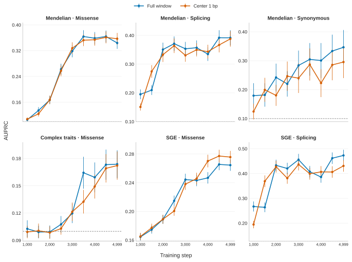
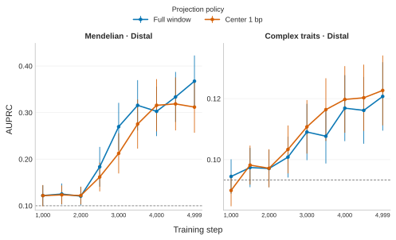

# Center-seeded projection for vertebrate training data

> [!NOTE]
> **TL;DR:** Center-1-bp projection is the default for new projection datasets because it is simpler, produced higher aggregate species–anchor recovery, and had broadly similar one-seed development AUPRC trajectories to full-window projection; existing full-window artifacts remain valid historical controls.

## Findings

Center-1 projects the central human nucleotide and extracts a fixed 255 bp target-genome window around its unique target locus.
Full-window projection instead reconciles compatible fragments, applies a 128–512 bp target-span gate, and resizes around the accepted span midpoint.

Across five audited regions, center-1 increased aggregate species–anchor recovery.
Recovery varied by region, and a sampled alignment trace found no general increase in external flank.
At matched tokens, corrected one-seed development AUPRC trajectories showed no consistent advantage for either policy across the region-relevant CDS and enhancer benchmarks.

Based on these results and the simpler contract, Gonzalo Benegas selected center-1 as the default for new projection datasets.
This operational choice does not establish statistical equivalence.
Existing full-window rules and artifacts remain available for reproducibility and historical comparisons.

## Evidence

A valid cross-policy validation-loss trajectory is unavailable.
Each native run used 16,384 chromosome-18 rows drawn from its own policy-specific dataset, the reused issue #417 full-window run lacks a W&B validation curve, and an earlier shared-row replay was withdrawn because it used an incompatible legacy-RoPE loading path.
These differences prevent validation loss from isolating a projection-policy effect, so no validation-loss figure informs the decision.

The comparison used four 0.25B models with one training seed.
Every arm presented 40,960,000 sequences and 10,485,760,000 tokens; the issue #417 CDS full-window arm was reused rather than retrained.
Development evaluation used the public `evals_v2` odd-autosome and chromosome-X `train` split and excluded mature-miRNA groups.
Corrected full-window checkpoints used the maintained legacy-RoPE compatibility boundary.

### Projection QC

All 135 projection partitions completed and yielded 74,524,203 species–anchor rows.
Every emitted interval was 255 bp and passed coordinate, chromosome, strand, and sequence-orientation checks.
The median projected-center displacement between policies was 3 bp.

  

_Recovery is measured over every requested species–anchor pair.
External-flank differences are center-1 minus full-window with 95% bootstrap intervals over human anchors in a 5,328-row trace sample._

Center-1 recovered 82.28% of requested pairs across the five regions, compared with 79.60% for full-window projection.
It increased recovery for CDS, ncRNA exon, and 3′ UTR, while enhancer-centered cCRE and TSS/5′ UTR recovery decreased.
Four of five paired external-flank intervals included zero; the 3′ UTR estimate was 1.143 additional bases [0.387, 2.204].
Recovery measures yield and does not prove that every accepted window is the correct homologous locus.

### Development evaluation

  

_Actual AUPRC at nine saved checkpoints from steps 1,000 through 4,999 for Mendelian missense, splicing, and synonymous variants; Complex-trait missense variants; and SGE missense and splicing variants.
Mendelian and Complex-trait panels aggregate their matched evaluation sets.
SGE panels report accession-macro AUPRC, with macro-propagated ±1 SE and a dashed baseline equal to mean per-accession prevalence.
Other vertical uncapped error bars are ±1 SE, other gray dashed baselines show positive-label prevalence, and each panel uses its own prevalence-anchored y-axis._

The CDS policies tracked closely for Mendelian missense and splicing, Complex-trait missense, and SGE missense.
Synonymous and SGE splicing varied more, but all three terminal CDS Mendelian paired 95% intervals included zero.

  

_Actual distal AUPRC at the same nine checkpoints.
Vertical uncapped error bars are ±1 SE, gray dashed lines show positive-label prevalence, and each panel uses its own prevalence-anchored y-axis._

The terminal Mendelian distal AUPRC favored full-window projection by 0.0557, with a paired 95% interval of [-0.100, -0.016] for center-1 minus full-window.
The Complex-trait distal difference was +0.0015 for center-1, and no additional seed tested whether the Mendelian result replicates.

## Limitations

- One training seed cannot establish statistical equivalence or the reproducibility of endpoint-level differences.
- The arms were matched on presented sequences and tokens, not effective epochs, because the policies produced different row counts.
- Recovery and sampled external-flank measurements do not establish locus-level homology.
- CDS and enhancer-centered cCREs have matched downstream training comparisons; three other regions have projection QC only.
- Held-out even-autosome and chromosome-Y VEP data remain untouched, so the interpretation is development-only.

## Related questions

- [How should genomic anchors be selected and projected across species?](../questions/genomic-anchors.md)

## Research record

- [Experiment issue #473](https://github.com/Open-Athena/marin-dna/issues/473)
