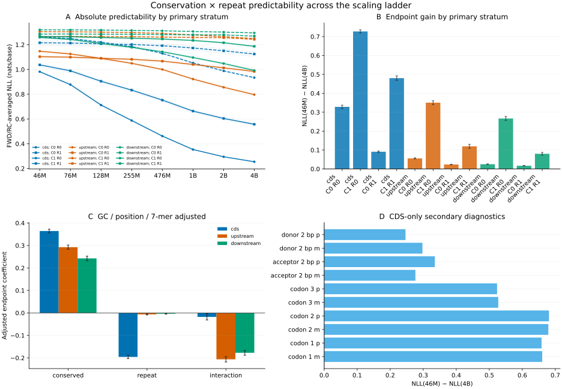
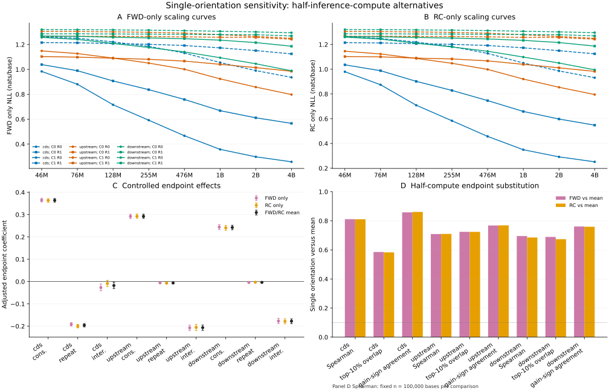

# Conservation and repeat predictability across model scale

> [!NOTE]
> **TL;DR:** Conserved bases gained more next-token predictability from 46M to 4B parameters after repeat, GC, local 7-mer, and position controls; this supports scale-dependent loss reduction as a candidate training weight, while the causal training benefit and the value of repeat downweighting remain untested.

_FWD/RC-averaged loss across the fixed-token ladder; bands and error bars in panels A–C are 95% genomic-block bootstrap CIs, panel D is CDS-only descriptive evidence, and the experiment does not measure causal training benefit._

## Findings

Conserved nonrepeat bases gained more predictability from 46M to 4B parameters in CDS, upstream, and downstream windows after adjustment for repeat status, GC content, local 7-mer predictability, and target position.
The adjusted conserved effects were 0.364 nats/base in CDS, 0.292 upstream, and 0.242 downstream.
Repeat interactions were negative in all three regions, so repeats gained less with scale, while the conserved effect remained positive within repeats.

The result supports same-corpus scale-dependent loss reduction as a candidate offline training weight.
Absolute 46M loss and predictive entropy also tracked conserved nonrepeat sequence under the same controls and provide cheaper baseline weights.
The experiment did not train with these weights, so it does not establish that any candidate improves language modeling or downstream prediction.

FWD-only and reverse-complement-only analyses preserved the group-level conservation and repeat effects.
In a fixed 100,000-base sample per comparison, one-orientation endpoint scores had 0.69–0.81 Spearman agreement with the averaged score.
One orientation recovered 58–72% of the averaged endpoint score's full-span top decile across regions and did not reproduce the exact per-base ranking.
Direct FWD-versus-reverse-complement agreement was substantially lower: sampled endpoint Spearman was 0.09–0.37 and full-span top-decile overlap was 0.25–0.45 across regions.
The orientations produced nearly symmetric controlled group estimates and closeness-to-mean metrics, so neither direction had empirical priority at the aggregate level; their per-base scores were not equivalent.

The CDS-only codon-position diagnostic passed on both feature strands: positions 1 and 2 gained about 0.66–0.68 nats/base, compared with about 0.52–0.53 at position 3.
Splice donor and acceptor results remain descriptive secondary evidence.

## Evidence

The audit used eight causal MarinDNA checkpoints from 46M through 4B parameters that were trained for the same token budget and mixture.
The mixture weights were 0.7319 CDS, 0.2062 upstream, and 0.0619 downstream, with uppercase loss weight 1.0 and lowercase repeat loss weight 0.01.

Each region contained 16,384 validation windows of 255 bases from the validation-matched RefSeq `GCF_000001405.40` assembly.
The primary span retained positions `[32, 223)` in 0-based half-open coordinates, leaving 3,129,344 analyzed bases per region and excluding 32 edge bases on each side.
All sequences matched the pinned validation windows after uppercasing, and no ambiguous bases were present.

The primary score averaged FWD loss with reverse-complement loss realigned to forward genomic coordinates.
Uncertainty used 1,000 bootstrap replicates over 10-Mb genomic blocks.
The controlled model was `score ~ conserved * repeat + GC + GC² + 7-mer NLL + 7-mer NLL² + position + position² + position³`.
The strand-averaged 7-mer control left out the target chromosome when estimating counts.

| Region | Conserved, nonrepeat | Repeat, nonconserved | Conserved × repeat |
|---|---:|---:|---:|
| CDS | 0.364 [0.356, 0.372] | -0.196 [-0.203, -0.188] | -0.018 [-0.031, -0.003] |
| Upstream | 0.292 [0.283, 0.302] | -0.006 [-0.009, -0.004] | -0.206 [-0.218, -0.195] |
| Downstream | 0.242 [0.232, 0.252] | -0.004 [-0.005, -0.002] | -0.177 [-0.188, -0.167] |

_Adjusted 46M-to-4B NLL-reduction coefficients in nats/base with 95% genomic-block bootstrap CIs; reference levels are nonconserved and nonrepeat._

All 24 comparisons with the prior forward-strand aggregate cache passed exact window-ID and case-count checks plus bounded cross-runtime drift gates.
The worst uppercase/lowercase correlation was 0.99999520/0.99999924, and the worst aggregate drift was 1.46×10⁻⁵/1.21×10⁻⁵ nats per token.

The all-255-position sensitivity preserved the primary ordering and direction.
All endpoint cell means were positive.
The only negative adjacent-rung means were 46M-to-76M changes of -0.00064 upstream and -0.00056 downstream for nonconserved repeats; every later adjacent mean in those cells was positive.

_Single-orientation scoring preserved adjusted group effects and halved inference compute. Spearman used a fixed 100,000-base sample per comparison; top-decile overlap and gain-sign agreement used the full central span._

| Region | Sampled Spearman (n = 100,000) | Full-span top-decile overlap | Full-span gain-sign agreement |
|---|---:|---:|---:|
| CDS | 0.811 | 0.583–0.586 | 0.858–0.861 |
| Upstream | 0.709–0.710 | 0.724 | 0.768–0.769 |
| Downstream | 0.685–0.695 | 0.674–0.689 | 0.759–0.761 |

_Ranges span FWD-only and reverse-complement-only comparisons with their arithmetic mean on the central primary span._

## Promising directions

Train a fixed-compute causal ablation comparing uniform loss, the current repeat weighting, 46M absolute-loss weighting, 46M entropy weighting, and scale-differential weighting.
Include averaged and deterministic single-orientation construction for the offline scores so the training result can determine whether the second inference pass is worth its cost.
Add compatible training-corpus exposure and homology-density covariates if they become available.

## Limitations

- Both checkpoints defining the scale-differential score were trained on the same corpus and objective.
  Their loss difference measures scale-dependent learnability, not Rho-1 reducible loss against a target-distribution reference model.
- The experiment is observational and inference-only.
  It does not establish a causal training benefit for any loss, entropy, or scale-differential weight.
- Exact training-corpus exposure and homology density were unavailable.
  Conservation effects may partly reflect memorization, paralogy, or phylogenetic redundancy not captured by GC and the local 7-mer control.
- The checkpoints used the current 100-fold repeat downweighting during training.
  Negative repeat effects and interactions do not determine whether that weighting helps; a matched uniform-loss ablation is required.
- Each model size contributed one checkpoint, so the parameter ladder does not measure seed variation.
- The data use the validation-matched RefSeq assembly rather than the project's canonical Ensembl release 115 GRCh38 reference.
  Exact uppercased sequence matching prevents silent assembly substitution within this audit but does not make the assemblies interchangeable.
- One-orientation agreement with the mean is partly structural because the mean contains that orientation.
  The top-decile and sign-agreement losses show that a single pass is not an exact per-base substitute.

## Related questions

- [Which genomic regions to train on, and how to find them?](../questions/training-regions.md)

## Research record

- [Experiment issue #478](https://github.com/Open-Athena/marin-dna/issues/478)
