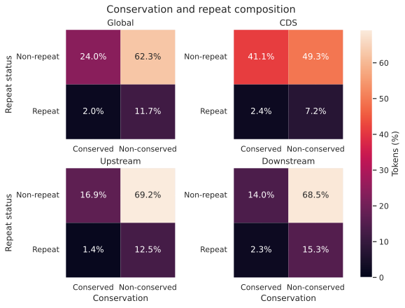
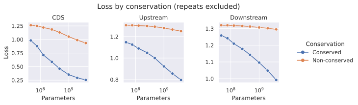
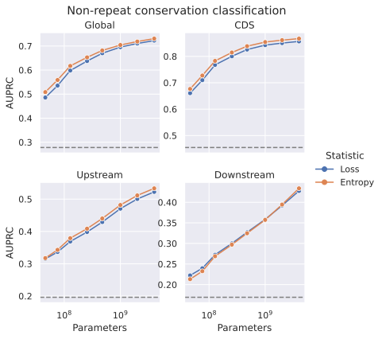
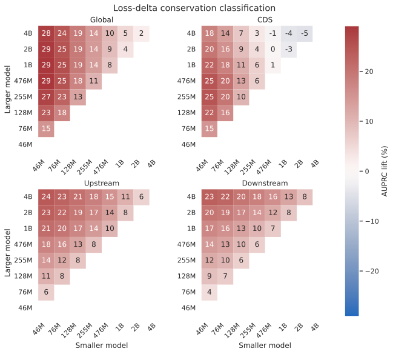
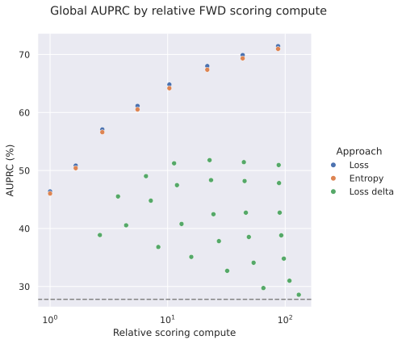
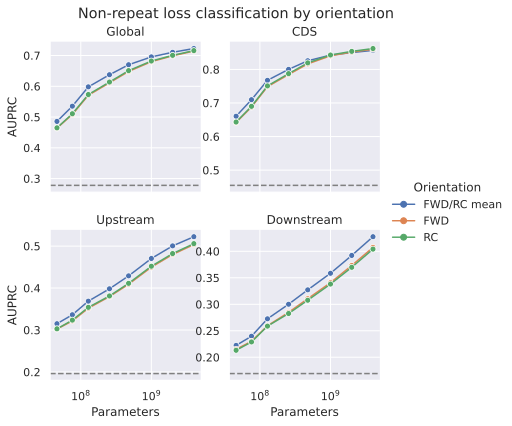

# Conservation and repeat predictability across model scale

> [!NOTE]
> **TL;DR:** Among nonrepeat human CDS, upstream, and downstream bases, lower loss and entropy ranked case-encoded conservation increasingly well from 46M to 4B parameters; one FWD pass gives the best cheap proxy, while controlled scale-dependent loss reduction remains a candidate training weight whose causal benefit is untested.

## Findings

  

_Case-encoded conservation × RefSeq repeat composition in the central span; percentages sum to 100 within each scope._

Across 9,388,032 central-span positions, 62.3% were nonrepeat and nonconserved, 24.0% were nonrepeat and conserved, 11.7% were repeat and nonconserved, and 2.0% were repeat and conserved.
Conserved nonrepeat sequence was more common in CDS at 41.1% of positions than upstream at 16.9% or downstream at 14.0%.

  

_FWD/RC-averaged loss at nonrepeat central positions; each point is the exact pooled mean for one model and class._

After repeats were excluded, conserved bases had lower loss than nonconserved bases at every model size in all three regions.
Loss decreased more with scale for conserved sequence, with the largest separation in CDS.

  

_Exact pooled AUPRC among nonrepeat positions; dashed lines are the conserved prevalence in each scope, and the y-axis range is specific to each panel._

Loss AUPRC increased monotonically from 0.486 at 46M to 0.723 at 4B globally.
Entropy AUPRC increased from 0.508 to 0.731 over the same ladder.
At 4B, loss AUPRC was 0.857 in CDS, 0.522 upstream, and 0.428 downstream; entropy AUPRC was 0.867, 0.533, and 0.434.

  

_FWD/RC-averaged loss-delta AUPRC lift over prevalence; the color range is symmetric around zero, and white cells are model pairs that do not exist._

The 46M-to-76M loss delta classified conservation above prevalence in every scope but was weaker than either absolute small-model score.
Its AUPRC was 0.429 globally, 0.603 in CDS, 0.260 upstream, and 0.214 downstream.
The best delta used 46M-to-1B globally at 0.569, 46M-to-255M in CDS at 0.702, and 46M-to-4B upstream and downstream at 0.436 and 0.400.

  

_Global FWD AUPRC against a parameter-pass compute proxy; one 46M FWD pass equals 1, and the dashed line is conserved prevalence._

Every FWD loss-delta candidate was dominated by a loss or entropy score with at least as high AUPRC and no greater estimated scoring compute.
FWD 46M loss and entropy reached 0.464 and 0.460 AUPRC at relative compute 1, while FWD 4B loss and entropy reached 0.714 and 0.710 at relative compute 87.
The compute proxy sums model parameter counts across the passes required for the same 255-base window and is not measured throughput.

The controlled 46M-to-4B loss reduction for conserved nonrepeat bases was 0.364 nats/base in CDS, 0.292 upstream, and 0.242 downstream after adjustment for repeat status, GC content, local 7-mer predictability, and target position.
Repeat interactions were negative in all three regions, so repeats gained less with scale while the conserved effect remained positive within repeats.

The controlled result supports same-corpus scale-dependent loss reduction as a candidate offline training weight.
The classification and compute comparison make one-orientation absolute loss or entropy the practical first proxy when scoring cost matters.
No likelihood-derived candidate has been tested as a training weight.

  

_Loss-based conservation classification by orientation; dashed lines are scope-specific prevalence._

FWD-only and reverse-complement-only AUPRC differed by at most 0.0053 across every scope and score.
One orientation retained 86–92% of the averaged 46M-loss lift over prevalence, 92–101% of the 4B-loss lift, and 71–75% of the 46M-to-76M delta lift.
Neither orientation had empirical priority, so FWD is a deterministic convention for the compute comparison rather than a biologically preferred direction.

One-orientation endpoint scores had 0.69–0.81 sampled Spearman agreement with the averaged score and recovered 58–72% of its full-span top decile across regions.
Direct FWD-versus-reverse-complement agreement was lower: sampled endpoint Spearman was 0.09–0.37 and full-span top-decile overlap was 0.25–0.45.
A single pass preserves aggregate conclusions and classification AUPRC but does not reproduce the averaged per-base ranking.

The CDS-only codon-position diagnostic passed on both feature strands.
Positions 1 and 2 gained about 0.66–0.68 nats/base, compared with about 0.52–0.53 at position 3.
Splice donor and acceptor results remain descriptive secondary evidence and do not generalize to UTR or promoter sequence.

## Evidence

The audit used eight causal MarinDNA checkpoints from 46M through 4B parameters trained for the same token budget and mixture.
The mixture weights were 0.7319 CDS, 0.2062 upstream, and 0.0619 downstream, with uppercase loss weight 1.0 and lowercase repeat loss weight 0.01.

Each region contained 16,384 validation windows of 255 bases from the validation-matched RefSeq GCF_000001405.40 assembly.
The primary span retained positions [32, 223) in 0-based half-open coordinates, leaving 3,129,344 positions per region and excluding 32 edge bases on each side.
All sequences matched the pinned validation windows after uppercasing, and no ambiguous bases were present.

The conservation-classification population excluded repeats and used case-encoded conservation as the positive class.

| Scope | Positions | Conserved | Prevalence |
|---|---:|---:|---:|
| Global | 8,104,672 | 2,252,035 | 0.278 |
| CDS | 2,830,380 | 1,286,562 | 0.455 |
| Upstream | 2,694,225 | 528,812 | 0.196 |
| Downstream | 2,580,067 | 436,661 | 0.169 |

The classification score was negative loss, negative four-nucleotide entropy, or smaller-model loss minus larger-model loss.
AUPRC is the exact pooled average precision for each scope.
Within-10-Mb-block AUPRC was retained as a genomic-variation diagnostic rather than a confidence interval for the pooled estimate.

| Scope | Prevalence | 46M loss | 4B loss | 46M entropy | 4B entropy | 46M→76M delta |
|---|---:|---:|---:|---:|---:|---:|
| Global | 0.278 | 0.486 | 0.723 | 0.508 | 0.731 | 0.429 |
| CDS | 0.455 | 0.661 | 0.857 | 0.676 | 0.867 | 0.603 |
| Upstream | 0.196 | 0.315 | 0.522 | 0.318 | 0.533 | 0.260 |
| Downstream | 0.169 | 0.222 | 0.428 | 0.213 | 0.434 | 0.214 |

_Exact pooled FWD/RC-averaged AUPRC among nonrepeat central positions._

The primary loss analysis averaged FWD loss with reverse-complement loss realigned to forward genomic coordinates.
Uncertainty used 1,000 bootstrap replicates over 10-Mb genomic blocks.
The controlled model was score ~ conserved × repeat + GC + GC² + 7-mer NLL + 7-mer NLL² + position + position² + position³.
The strand-averaged 7-mer control left out the target chromosome when estimating counts.

| Region | Conserved, nonrepeat | Repeat, nonconserved | Conserved × repeat |
|---|---:|---:|---:|
| CDS | 0.364 [0.356, 0.372] | -0.196 [-0.203, -0.188] | -0.018 [-0.031, -0.003] |
| Upstream | 0.292 [0.283, 0.302] | -0.006 [-0.009, -0.004] | -0.206 [-0.218, -0.195] |
| Downstream | 0.242 [0.232, 0.252] | -0.004 [-0.005, -0.002] | -0.177 [-0.188, -0.167] |

_Adjusted 46M-to-4B NLL-reduction coefficients in nats/base with 95% genomic-block bootstrap CIs; reference levels are nonconserved and nonrepeat._

Within 10-Mb blocks, 46M loss beat local prevalence in 99.7% of evaluable global and CDS blocks, 99.0% upstream, and 86.2% downstream.
The 46M-to-76M delta beat local prevalence in 100%, 100%, 98.1%, and 91.3% of the corresponding blocks.
These fractions describe genomic variation and are not confidence intervals for pooled AUPRC.

All 24 comparisons with the prior forward-strand aggregate cache passed exact window-ID and case-count checks plus bounded cross-runtime drift gates.
The worst uppercase/lowercase correlation was 0.99999520/0.99999924, and the worst aggregate drift was 1.46×10⁻⁵/1.21×10⁻⁵ nats per token.

The all-255-position sensitivity preserved the primary ordering and direction.
All endpoint cell means were positive.
The only negative adjacent-rung means were 46M-to-76M changes of -0.00064 upstream and -0.00056 downstream for nonconserved repeats; every later adjacent mean in those cells was positive.

## Limitations

- Validation casing defines conservation as phyloP-241way ≥ 2.27.
  The nonconserved class combines observed below-threshold bases with missing or unaligned positions.
- Conservation is an evaluation proxy rather than a complete definition of functional sequence.
  The classification results do not establish out-of-distribution functional discovery.
- Both checkpoints defining a scale-differential score were trained on the same corpus and objective.
  Their loss difference measures scale-dependent learnability rather than Rho-1 reducible loss against a target-distribution reference model.
- The experiment is observational and inference-only.
  It does not establish a causal training benefit for any loss, entropy, or scale-differential weight.
- Exact training-corpus exposure and homology density were unavailable.
  Conservation effects may partly reflect memorization, paralogy, or phylogenetic redundancy not captured by GC and the local 7-mer control.
- The checkpoints used the current 100-fold repeat downweighting during training.
  Negative repeat effects and interactions do not determine whether that weighting helps; a matched uniform-loss ablation is required.
- Each model size contributed one checkpoint, so the parameter ladder does not measure seed variation.
- The compute comparison uses summed parameter-passes as a relative proxy.
  It does not measure FLOPs, runtime, memory, or windows per hour.
- The data use the validation-matched RefSeq assembly rather than the project's canonical Ensembl release 115 GRCh38 reference.
  Exact uppercased sequence matching prevents silent assembly substitution within this audit but does not make the assemblies interchangeable.
- One-orientation agreement with the mean is partly structural because the mean contains that orientation.
  The top-decile and sign-agreement losses show that a single pass is not an exact per-base substitute.

## Related questions

- [Which genomic regions to train on, and how to find them?](../questions/training-regions.md)

## Research record

- [Experiment issue #478](https://github.com/Open-Athena/marin-dna/issues/478)
