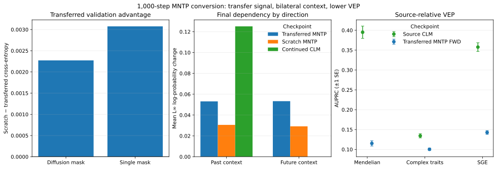

# Full-attention MNTP adaptation of MarinDNA m5.1

> [!NOTE]
> **TL;DR:** A one-seed 1B pilot found that 1,000 full-parameter MNTP steps created bilateral context use and a small transferred-versus-scratch validation advantage, while the converted checkpoint scored below source CLM on all three development VEP endpoints and an integrity audit found no training or inference bug that explains the regression.

_At step 1,000, positive validation deltas favor transferred MNTP; dependency is the mean L∞ change in A/C/G/T log probability across 32,385 off-diagonal position pairs at tRNA-Arg-TCT; MNTP uses masked readouts and CLM uses causal next-token readouts, so absolute magnitudes are not directly comparable; VEP compares source CLM FWD+RC with transferred MNTP FWD. Validation and dependency are deterministic one-seed summaries without error bars; VEP error bars are ±1 SE from 1,000 matched-group or within-SGE-cell bootstrap resamples, combined across subsets for macro endpoints._

## Findings

Full-parameter masked-next-token-prediction adaptation converted the causal MarinDNA m5.1 checkpoint into a behaviorally bidirectional model within 1,000 optimizer steps.
Transferred MNTP ended with 0.39727 diffusion-mask validation cross-entropy and 0.31008 single-mask cross-entropy, compared with 0.39954 and 0.31315 for scratch MNTP.
At the final tRNA-Arg-TCT dependency probe, transferred MNTP had mean past- and future-context effects of 0.05314 and 0.05334.
Continued CLM had a 0.12510 past-context effect and exactly zero future-context effect.

The transferred checkpoint did not improve the registered development VEP endpoints.
Its forward-orientation AUPRC was 0.1151 on Mendelian variants, 0.1003 on Complex Traits, and 0.1427 on SGE, compared with source-CLM forward/reverse-complement averages of 0.3951, 0.1342, and 0.3577.
Transferred forward/reverse-complement averages differed from its forward scores by less than 0.001 on every endpoint, so orientation averaging did not recover the regression.

The integrity audit found no serialization, deterministic replay, coordinate, tokenizer, special-token, shifted-readout, shared-loss-path, or optimization-instability bug that accounts for the VEP result.
It did find a batch-shape mismatch in the original nucleotide-dependency diagnostic.
The corrected final-checkpoint maps use each wild-type baseline and all substitutions in the same model call and supersede the original maps.

The evidence supports cheap behavioral conversion under this setup.
It does not support extending the same MNTP recipe to 10,000 steps without a source-relative representation or sequence-to-function gain.

## Evidence

The pilot started from the released 1B MarinDNA m5.1 checkpoint and trained three independent 1,000-step arms on one Lambda GH200: transferred MNTP, scratch MNTP, and causal continuation.
Source CLM and full attention without adaptation were evaluation controls.
Training and validation used the same shared per-sequence weighted-loss reducer.
Lowercase repeat bases had weight 0.01 and uppercase bases weight 1.0 in both paths.
The fixed validation plan contained 128 sequences from each of CDS, downstream, enhancer, ncRNA, and upstream data.

The registered VEP evaluation used only odd autosomes and chromosome X.
Mendelian AUPRC is a macro average over qualifying consequence subsets on 16,100 variants; Complex Traits is global AUPRC on 11,630 variants; SGE is an accession/consequence macro average on 23,853 variants.

| Dataset | Source CLM FWD+RC | Transferred MNTP FWD | Scratch MNTP FWD | Continued CLM FWD+RC |
|---|---:|---:|---:|---:|
| Mendelian | 0.3951 ± 0.0155 | 0.1151 ± 0.0067 | 0.1112 ± 0.0059 | 0.3064 ± 0.0132 |
| Complex Traits | 0.1342 ± 0.0052 | 0.1003 ± 0.0031 | 0.1018 ± 0.0031 | 0.1188 ± 0.0048 |
| SGE | 0.3577 ± 0.0110 | 0.1427 ± 0.0048 | 0.1378 ± 0.0041 | 0.3052 ± 0.0103 |

Source save/reload and replayed continued CLM at step 400 were bit-exact across 51,623 odd-autosome/X variants in both orientations.
All three 400-step training replays reproduced the original per-step losses exactly.
No replay had a post-warmup loss spike.
Continued CLM had mild pre-clipping gradient norms (median/p95/max 0.791/1.002/1.263).
Transferred and scratch MNTP instead had large, rapidly decaying clipped transients: p95/max 11.11/60.52 and 28.26/85.00, with clipping on 68.75% and 74.0% of their first 400 steps.

Continued-CLM degradation was progressive.
Fixed-plan validation cross-entropy was 0.23138 at step 0 and step 1, 0.23131 at step 10, 0.27310 at step 100, 0.33297 at step 400, and 0.35965 at step 800 before recovering to 0.35010 after cooldown at step 1,000.
The trajectory is consistent with destructive optimization under the fresh-optimizer/high-learning-rate configuration, while exact load/save and inference parity rule out those mismatch classes.
Preserved-optimizer and lower-learning-rate causal controls were not run, so the audit does not isolate the cause.

The completed pilot, recovery work, cancelled diagnostics, and final integrity audit cost an estimated $24.73 at cloud list price.

## Promising directions

- Compare transferred ordinary same-position MLM with transferred MNTP at the same source checkpoint and small update budget.
- Test frozen layer and pooling choices on functional-region or token-level probes where right context has a direct mechanism.
- Compare source and converted checkpoints in a matched supervised sequence-to-function task before funding longer adaptation or additional seeds.

## Limitations

- Each training arm used one seed, one source checkpoint, and one 1,000-step schedule.
- The experiment did not include a matched ordinary-MLM adaptation arm.
- The final corrected directional dependency comparison used one 255-base tRNA-Arg-TCT window. Context-ablation probes supported bilateral behavior, but the final dependency magnitudes do not establish genome-wide use.
- The VEP cohorts are development data on odd autosomes and chromosome X. No held-out even-autosome or chromosome-Y labels were accessed.
- Direct masked-site VEP may miss useful information in internal representations or supervised sequence-to-function settings.
- The causal-continuation arm reset optimizer state and used a high registered learning-rate schedule, so it is not evidence that all continued causal training damages m5.1.

## Related questions

- [Can causal gLM checkpoints be cheaply adapted into bidirectional representation models?](../questions/bidirectional-models.md)

## Research record

- [Experiment issue #479](https://github.com/Open-Athena/marin-dna/issues/479)
