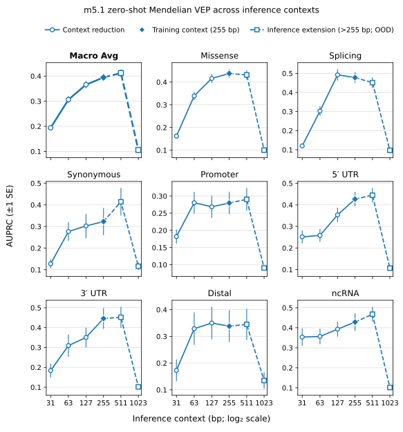
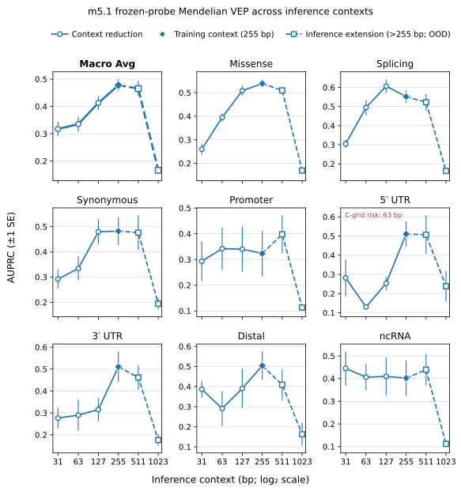

# Inference-context sensitivity of m5.1 Mendelian VEP

> [!NOTE]
> **TL;DR:** For the 255 bp-trained m5.1 checkpoint, cropping inference below 255 bp reduced Mendelian development macro AUPRC, extending to 511 bp produced a small zero-shot gain but no probe gain, and extending to 1023 bp sharply degraded both protocols.

## Findings

Mendelian variant-effect prediction was sensitive to inference context even though checkpoint weights, tokenizer, dataset, split, and evaluation protocols were fixed.
From 31 to the 255 bp training context, macro AUPRC increased from 0.1941 to 0.3945 zero-shot and from 0.3174 to 0.4779 with a newly trained frozen probe.
The macro trend was monotonic over 31, 63, 127, and 255 bp in both protocols, although individual consequence subsets were not uniformly monotonic.

Extending inference from 255 to 511 bp increased zero-shot macro AUPRC by 0.0175, with a paired 95% interval that excluded zero.
The corresponding probe change was -0.0124 and its paired interval included zero.
The 511 bp arm therefore supports a small protocol-specific zero-shot benefit, not a general benefit from doubling inference context.

Extending again from 511 to 1023 bp reduced macro AUPRC by 0.3060 zero-shot and 0.2993 with the probe.
Both paired intervals excluded zero, and every zero-shot consequence subset declined.
Inference-only extension to four times the checkpoint's training context is therefore unreliable for this checkpoint and task.

## Evidence

_Zero-shot matched-pair AUPRC for the fixed m5.1 checkpoint; error bars are ±1 SE, each panel has an independent y-axis, and 511 and 1023 bp are inference-only extensions beyond the 255 bp training context._

_Frozen-probe per-chromosome-weighted AUPRC when a new probe is trained at each context; error bars are ±1 SE and each panel has an independent y-axis._

The experiment used `mix-v0.9-p1B-i24-exp135-m5.1-step-59158`, a causal 1B-parameter model trained with 255 DNA bases plus a BOS token.
The six inference windows were 31, 63, 127, 255, 511, and 1023 DNA bases, centered on the same SNV.
The 511 and 1023 bp forwards were executable because the model uses rotary positions rather than a learned positional-embedding table, but those positions were not observed during training.

Evaluation used 16,140 rows from the pinned `mendelian_traits` development `train` split.
The macro average covered eight consequence subsets, 16,100 rows, and 1,610 matched groups.

| Inference context | Zero-shot macro AUPRC ± SE | Frozen-probe macro AUPRC ± SE |
|---:|---:|---:|
| 31 bp | 0.1941 ± 0.0102 | 0.3174 ± 0.0269 |
| 63 bp | 0.3064 ± 0.0143 | 0.3354 ± 0.0266 |
| 127 bp | 0.3658 ± 0.0149 | 0.4130 ± 0.0255 |
| 255 bp | 0.3945 ± 0.0155 | 0.4779 ± 0.0216 |
| 511 bp | 0.4121 ± 0.0153 | 0.4654 ± 0.0280 |
| 1023 bp | 0.1061 ± 0.0048 | 0.1661 ± 0.0106 |

Zero-shot scoring used the forward/reverse-complement-averaged likelihood-ratio score and the existing matched-pair AUPRC estimator.
The frozen probe used the concatenated reference and alternate-minus-reference embeddings, leave-one-chromosome-out predictions, and inner chromosome-grouped regularization tuning.
A separate probe was trained at every context, so the probe comparison measures representation decodability under a fixed supervised protocol.

| Protocol | Comparison | AUPRC delta | Paired SE | Paired 95% interval | Two-sided p |
|---|---|---:|---:|---:|---:|
| Zero-shot | 255→511 bp | +0.0175 | 0.0057 | [+0.0057, +0.0278] | 0.0024 |
| Frozen probe | 255→511 bp | -0.0124 | 0.0129 | [-0.0408, +0.0087] | 0.3138 |
| Zero-shot | 511→1023 bp | -0.3060 | 0.0154 | [-0.3359, -0.2762] | <0.0002 |
| Frozen probe | 511→1023 bp | -0.2993 | 0.0308 | [-0.3525, -0.2304] | <0.0002 |

The paired analyses used 10,000 reproducible draws.
The zero-shot analysis preserved matched groups, and the probe analysis preserved shared chromosome draws across arms and macro-eligible subsets.
The <0.0002 entries had no opposing-tail draw and are reported at the two-sided Monte Carlo resolution rather than as exact p-values.
The reported p-values are unadjusted; the macro comparisons were the primary interpretation rather than a multiple-testing claim across every subset.

## Limitations

- All labels, model selection, probe fitting, and interpretation use the Mendelian development split; held-out labeled results were not accessed.
- The experiment evaluates one checkpoint, one SNV cohort, and two VEP protocols, so it does not establish a universal genomic context length.
- The 511 and 1023 bp arms are positional and sequence-length extrapolations of a model trained at 255 bp, not models trained for longer context.
- The zero-shot score includes the variant-position term and downstream likelihood terms, so changing context changes both available sequence and the score's contributing positions.
- A new probe was fitted at each context, so probe differences do not measure the robustness of one transferred classifier.
- The 63 bp 5′ UTR probe had a regularization-grid truncation diagnostic and should not drive a subset-specific claim.
- Arm-wise figure error bars and paired comparison intervals answer different questions and should not be compared across protocols.

## Related questions

- [What context sizes do genomic language models need for different biological tasks, and how should models acquire and use that context?](../questions/long-context.md)

## Research record

- [Experiment issue #485](https://github.com/Open-Athena/marin-dna/issues/485)
