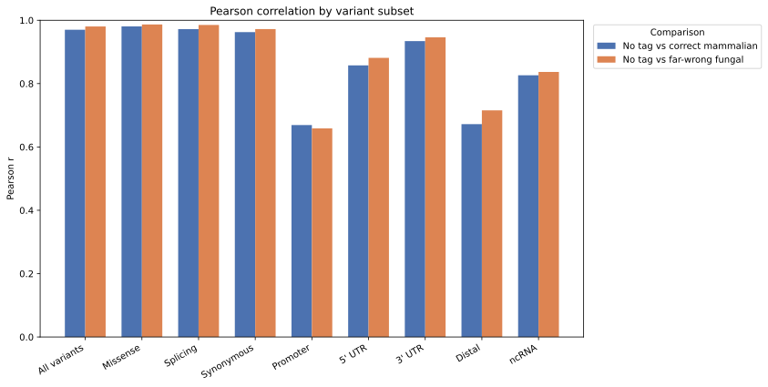
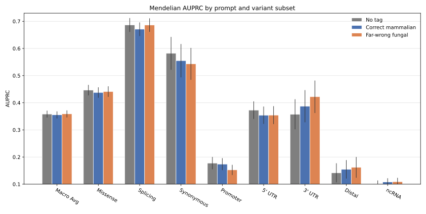

# Carbon species-prompt sensitivity on Mendelian VEP

> [!NOTE]
> **TL;DR:** On 16,100 development-set Mendelian variants, correct mammalian and far-wrong fungal prompts changed Carbon-3B scores but did not establish a macro-AUPRC difference from no tagging; the frozen-checkpoint result measures inference-time prompt sensitivity, not the value of tag-conditioned pretraining.

## Findings

### Variant-level score agreement

_Bars report Pearson correlation over all retained variants in each category; the [experiment issue](https://github.com/Open-Athena/marin-dna/issues/486#issuecomment-5371806938) contains the individual-variant scatter plots and positive/negative breakdowns._

No-tag scores had pooled Pearson correlations of 0.970 with correct-mammalian scores and 0.981 with far-wrong-fungal scores.
Agreement was lower for promoter variants at 0.669 and 0.659 and for distal variants at 0.672 and 0.715.
Prompt-induced changes were largest relative to the no-tag score spread in these near-neutral subsets.
This supports prompt sensitivity without establishing useful or biological reranking; Pearson correlation does not measure rank preservation.

### AUPRC by consequence subset

_The y-axis begins at 0.1, the prevalence implied by each 1:9 matched group; uncapped whiskers are ±1 bootstrap standard error over complete match groups, lower whiskers below 0.1 are clipped, and mature miRNA is excluded._

AUPRC was similar across prompt conditions, with no consistent subset pattern favoring either tag.
Subset differences were mixed in direction and exploratory, with no multiplicity correction or testing hierarchy.
Neither species prompt established a macro-AUPRC difference from no tagging.
Correct mammalian conditioning changed macro AUPRC by -0.0030, with a 95% paired-bootstrap interval of [-0.0183, 0.0088].
The far-wrong fungal prompt changed it by +0.0005 [-0.0137, 0.0124].

## Evidence

The analysis held the `HuggingFaceBio/Carbon-3B` checkpoint, sequence, scorer, and variants fixed while changing only the prompt prefix.
The three prompts were `<dna>` for no tagging, `<species>vertebrate_mammalian<dna>` for correct mammalian conditioning, and `<species>fungi<dna>` for the far-wrong control.
Carbon saw metadata on half of its eukaryotic pretraining examples, so the same checkpoint supports conditional and unconditional prompts.
The comparison used the pinned `train` split of `marin-dna/evals_mendelian_traits`, restricted to odd-numbered autosomes and chromosome X.
No held-out variants were scored or analyzed.

The retained population contained 16,100 single-nucleotide variants in 1,610 complete groups, with one pathogenic positive and nine matched negatives per group.
The macro average weights eight consequence subsets equally.

Each allele was scored in forward and reverse-complement orientations after the 8,192-base input was truncated to 8,190 bases at Carbon's deterministic 6-mer boundary.
The variant score was the negative mean REF-to-ALT causal log-likelihood difference, averaged across orientations.
Carbon's raw means include prompt tokens, giving 1,365 post-first tokens without a tag, 1,373 with the mammalian prefix, and 1,370 with the fungal prefix.
Cross-prompt score comparisons therefore multiply each raw score by its post-first token count divided by 1,365, yielding nats per common DNA target token.
This rescaling does not change within-prompt AUPRC or pairwise Pearson correlation.

Uncertainty used 1,000 seeded bootstrap draws over complete match groups.
The same draw was used for both prompts in every paired AUPRC contrast.

## Limitations

- The experiment used development data and explored consequence-specific patterns on the same data.
  It has no multiplicity correction or testing hierarchy.
- One frozen Carbon-3B checkpoint and one human 8-kb context regime do not measure training-seed uncertainty, model-scale dependence, shorter-context behavior, or performance in low-resource taxa.
- Comparing prompts at inference in one checkpoint cannot identify the causal effect of metadata-conditioned pretraining.
- The mammalian and fungal prefixes differ in token count and content.
  Common-denominator normalization removes the deterministic mean-likelihood scale difference but does not create an equal-length semantic control.
- Pearson correlation and the relative prompt-change ratio have no uncertainty intervals here.
  Pearson does not establish rank preservation or rank change, and the relative ratio is a diagnostic algebraically related to Pearson rather than independent evidence of noise.

## Related questions

- [Does conditioning on species/clade help?](../questions/species-conditioning.md)

## Research record

- [Experiment issue #486](https://github.com/Open-Athena/marin-dna/issues/486)
