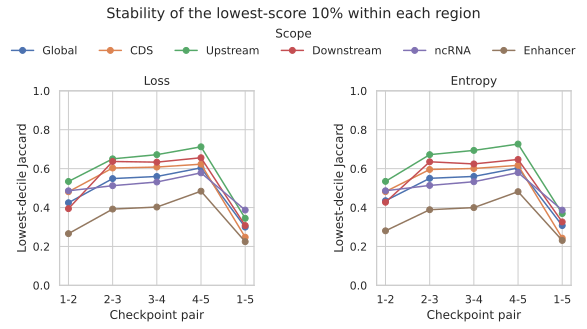
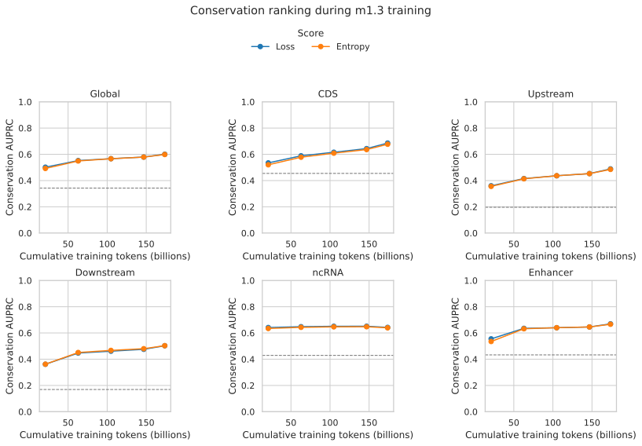
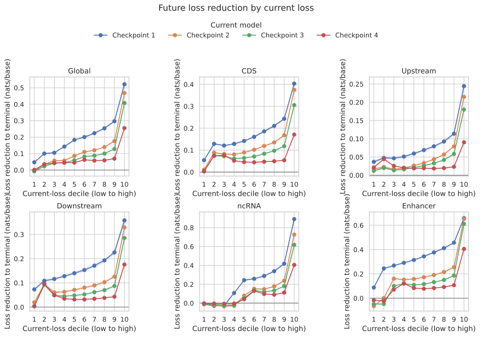
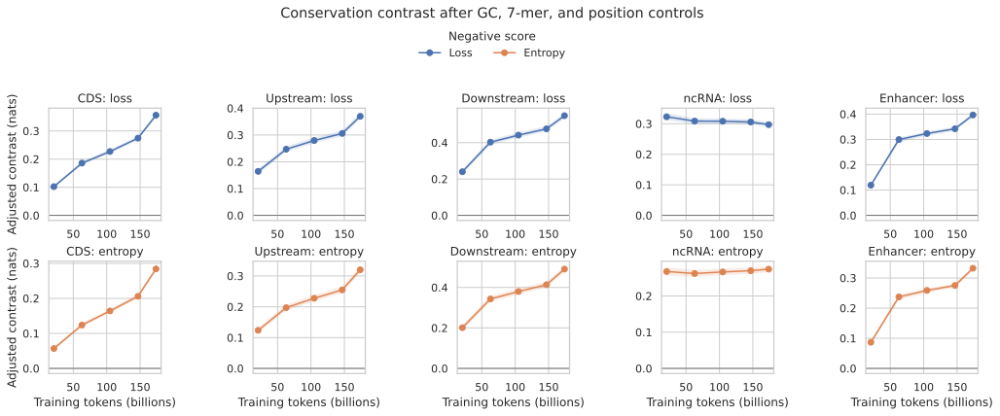

# Likelihood-derived token rankings through m1.3 training

> [!NOTE]
> **TL;DR:** In the fixed 1B m1-to-m1.3 lineage, lower loss ranked conservation by the earliest 21B-token checkpoint and strengthened through training, but lowest-loss membership remained too time- and region-dependent for a default online mask; use a frozen sufficiently trained teacher for the primary causal test.

_Region-specific lowest-score-decile overlap increases between later adjacent checkpoints, but the low endpoint overlap shows that an instantaneous student mask does not select a fixed population._

## Findings

Lower forward loss and four-nucleotide predictive entropy ranked case-encoded conservation by the earliest available checkpoint.
Global loss AUPRC increased from 0.502 at 21.0B cumulative tokens to 0.601 at 173.7B, while entropy AUPRC increased from 0.492 to 0.599.
The trend strengthened in CDS, upstream, downstream, and enhancer sequence, while ncRNA loss AUPRC was nearly flat and peaked before the terminal checkpoint.

The lowest-score 10% within each region became more stable between adjacent checkpoints, but the selected population continued to change.
Global loss Jaccard rose from 0.425 for the first adjacent pair to 0.604 for the final pair and was 0.299 from the first to terminal checkpoint.
Enhancer had the greatest churn, with loss Jaccard 0.266 for the first pair, 0.484 for the final pair, and 0.225 end to end.

High-current-loss positions had substantially more remaining optimization opportunity than low-current-loss positions.
From the first to terminal checkpoint, the global highest current-loss decile improved by 0.521 nats/base, compared with 0.047 for the lowest decile.
The lowest decile's mean loss increased over each of the first three next-checkpoint intervals, whereas the highest decile improved over every interval.

Conservation remained positively associated with negative loss and entropy in every region and checkpoint after the specified GC, held-out 7-mer, and target-position controls.
This supports frozen loss or entropy as a composition-adjusted conservation proxy within these panels.
It does not establish that likelihood-derived weighting improves training.

A frozen sufficiently trained teacher should define the primary likelihood-derived selector in a causal experiment.
An online student-derived low-loss selector is a diagnostic self-paced objective and should use a uniform warm-up, temporal smoothing, and a nonzero background floor.
Absolute low loss is not Rho-1 reducible loss because no target-distribution reference model is subtracted.

_Exact pooled AUPRC among nonrepeat central positions; dashed lines are scope-specific conserved prevalence, and the earliest checkpoint is already above prevalence in every region._

_Current high-loss positions improve more by the terminal checkpoint than current low-loss positions; this is an observational optimization trajectory rather than a tested selection intervention._

_Conserved-minus-other contrasts after GC, held-out 7-mer, and target-position controls; bands are 95% genomic-block bootstrap intervals._

## Evidence

The experiment followed one 1B causal lineage through five on-path checkpoints.

| Checkpoint | Cumulative training tokens |
| --- | ---: |
| m1 step 10,000 | 20,971,520,000 |
| m1.1 step 30,000 | 62,914,560,000 |
| m1.2 step 50,000 | 104,857,600,000 |
| m1.3 step 70,000 | 146,800,640,000 |
| m1.3 step 82,823 | 173,692,420,096 |

Each checkpoint scored one forward orientation for all scorable tokens in complete 16,384-window CDS, upstream, downstream, ncRNA, and enhancer probes from the MarinDNA blog Hugging Face collection.
The durable cache contains 104,448,000 token rows across 25 checkpoint-region cells.
The primary analysis retained target positions `[32, 223)` in 0-based half-open coordinates and excluded repeats, ambiguous targets, and unscorable targets.

| Scope | Primary positions | Conserved | Prevalence |
| --- | ---: | ---: | ---: |
| Global | 14,002,032 | 4,792,703 | 0.342 |
| CDS | 2,830,380 | 1,286,562 | 0.455 |
| Upstream | 2,694,225 | 528,812 | 0.196 |
| Downstream | 2,580,067 | 436,661 | 0.169 |
| ncRNA | 2,978,835 | 1,277,361 | 0.429 |
| Enhancer | 2,918,525 | 1,263,307 | 0.433 |

| Scope | Loss AUPRC at 21.0B | Loss AUPRC at 173.7B | Change |
| --- | ---: | ---: | ---: |
| Global | 0.502 | 0.601 | +0.099 |
| CDS | 0.535 | 0.686 | +0.151 |
| Upstream | 0.360 | 0.489 | +0.129 |
| Downstream | 0.362 | 0.503 | +0.141 |
| ncRNA | 0.641 | 0.642 | +0.001 |
| Enhancer | 0.555 | 0.669 | +0.114 |

AUPRC is exact pooled average precision from negative loss or negative entropy.
The lowest-score set contains exactly the floor of 10% of primary positions within each region, with ascending token index as the deterministic tie break.
Global overlap pools region-specific set intersections and unions rather than applying a global threshold.

Using each region's earliest and terminal mean NLL as the high/low thresholds, 36.7% of positions were low to low, 37.8% high to high, 11.7% high to low, and 13.8% low to high.
Conservation prevalence was 44.5% in low-to-low positions, 50.3% in high-to-low positions, 25.4% in low-to-high positions, and 22.5% in high-to-high positions.

Current-loss deciles were equal-count rank bins computed separately within each region.
The reduction outcome was current NLL minus next or terminal NLL, so a positive value denotes improvement.

The controlled model was negative score ~ conserved + GC + GC² + held-out 7-mer NLL + 7-mer NLL² + position + position² + position³.
At the terminal checkpoint, the conserved coefficient for negative loss was 0.356 [0.349, 0.363] nats in CDS, 0.370 [0.359, 0.381] upstream, 0.548 [0.535, 0.562] downstream, 0.297 [0.289, 0.306] in ncRNA, and 0.396 [0.389, 0.403] in enhancer.
Intervals and distribution summaries used 500 bootstrap replicates over region-specific 10 Mb genomic blocks with seed 489.

The pilot, full GPU sweep, and CPU analysis cost an estimated $1.79 in SkyPilot: $0.51 for the pilot, $1.07 for full scoring, and $0.21 for analysis.
The complete reducer ran in 3m34s with 5.46 GiB maximum resident memory on an AWS r7i.2xlarge.

## Promising directions

- Run a fixed-compute causal comparison of uniform nonrepeat loss, frozen-teacher loss or entropy weighting, an online student-derived diagnostic with warm-up and smoothing, and direct conservation weighting as an oracle positive control.
- Sweep the frozen teacher checkpoint to test whether the selector needs a terminal model or whether a cheaper intermediate checkpoint preserves downstream results.
- Compare absolute frozen loss with target-distribution reducible loss and same-corpus scale-differential loss as distinct selectors.
- Prefer soft weights with a nonzero background floor over a permanent hard lowest-decile mask unless a downstream result justifies the coverage loss.

## Limitations

- The first observed checkpoint is already at 21.0B tokens.
  The experiment cannot identify when conservation ranking first emerged before that point.
- One model lineage and one checkpoint per training stage were measured.
  Seed variation and alternative mixtures are unobserved.
- Validation casing defines the conservation label and is an incomplete proxy for function.
  Lineage-specific, weakly conserved, or unaligned functional sequence can be labeled negative.
- GC, local 7-mer predictability, and target position were controlled, but exact training-corpus exposure and homology density were unavailable.
  Memorization or phylogenetic redundancy may explain part of the association.
- ncRNA and enhancer use the blog's clean Zoonomia validation recipes, while CDS, upstream, and downstream use the validation-matched RefSeq probes.
  The region comparison is not a matched causal contrast.
- The trajectory groups use region means at two checkpoints and are descriptive.
  The decile analysis is the threshold-free view.
- The experiment is inference-only.
  No selector was used to train a student, so downstream benefit and likelihood calibration remain unknown.

## Related questions

- [Which genomic regions to train on, and how to find them?](../questions/training-regions.md)

## Research record

- [Experiment issue #489](https://github.com/Open-Athena/marin-dna/issues/489)
