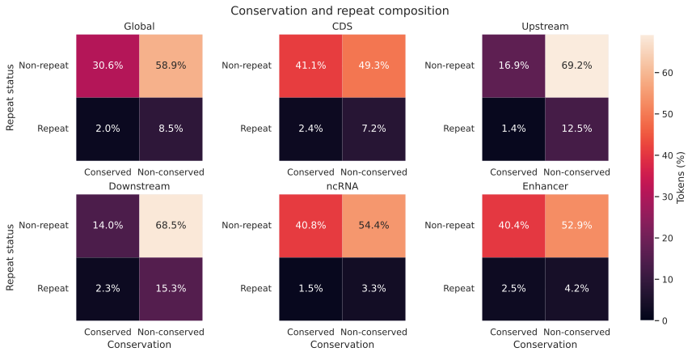
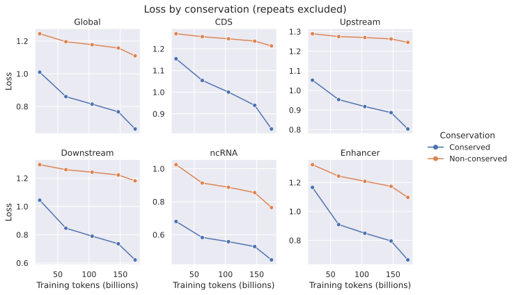
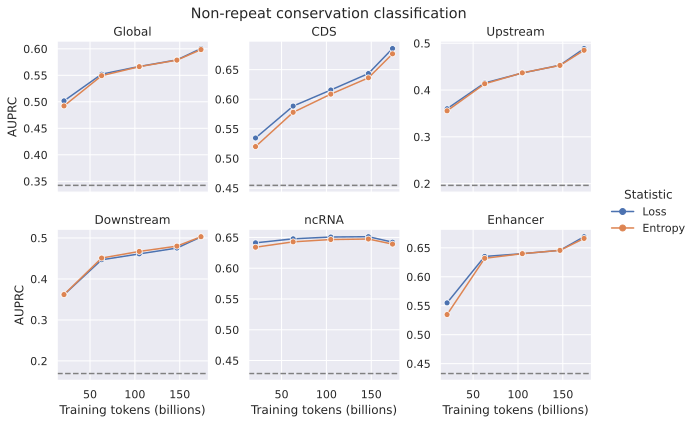
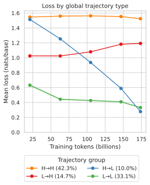
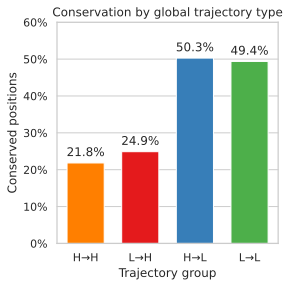
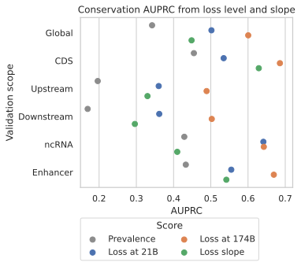

# Likelihood-derived token rankings through m1.3 training

> [!NOTE]
> **TL;DR:** In the fixed 1B m1-to-m1.3 lineage, conserved nonrepeat positions had lower loss throughout training and terminal loss ranked conservation better than the five-checkpoint loss slope; fitted trajectory groups differed in conservation prevalence and functional-region composition but remain descriptive.

## Findings

  

_Case-encoded conservation × reference-matched repeat composition in the central span; percentages sum to 100 within each scope._

Across the five validation panels, 30.6% of positions were nonrepeat and conserved, 58.9% were nonrepeat and nonconserved, 2.0% were repeat and conserved, and 8.5% were repeat and nonconserved.
Repeats accounted for 10.5% of positions globally, ranging from 4.8% in ncRNA to 17.6% downstream.

  

_Exact pooled forward loss in nats/base at nonrepeat central positions; each point is one checkpoint, and the y-axis range is specific to each panel._

Conserved positions had lower forward loss than nonconserved positions at every observed checkpoint in every scope.
The gap widened through training in the global, CDS, upstream, downstream, and enhancer panels.
ncRNA began with the largest gap and changed less than the other regions.

  

_Exact pooled AUPRC among nonrepeat central positions; the global panel combines the two conservation-label definitions documented below, dashed lines are scope-specific prevalence, and the y-axis range is specific to each panel._

Lower forward loss and four-nucleotide predictive entropy ranked case-encoded conservation by the earliest available checkpoint.
Global loss AUPRC increased from 0.502 at 21.0B cumulative tokens to 0.601 at 173.7B, while entropy AUPRC increased from 0.492 to 0.599.
The trend strengthened in CDS, upstream, downstream, and enhancer sequence, while ncRNA loss AUPRC was nearly flat and peaked before the terminal checkpoint.

  

_Mean forward loss for four global trajectory groups among nonrepeat central positions; H and L denote fitted endpoint loss above and below the fitted global population mean, curves are exact pooled checkpoint means, and bands are 95% genomic-block bootstrap intervals._

The fitted global thresholds assigned 42.3% of positions to high-to-high, 33.1% to low-to-low, 10.0% to high-to-low, and 14.7% to low-to-high.
The high-to-low group fell from 1.514 to 0.278 nats/base, while the low-to-high group rose from 1.025 to 1.192 nats/base.
These groups describe fitted loss endpoints relative to global thresholds; they are not quantiles or biological classes.

  

_Exact pooled conserved-position prevalence within each global fitted trajectory group among nonrepeat central positions; the global aggregate combines the two conservation-label definitions documented below._

Terminal-low groups were about twice as often conserved as terminal-high groups.
Conservation prevalence was 50.3% for high-to-low and 49.4% for low-to-low, compared with 24.9% for low-to-high and 21.8% for high-to-high.

  

_Exact functional-region composition within each global fitted trajectory group among nonrepeat central positions; every bar sums to 100%, and the region labels denote validation-panel membership._

High-to-low was 36.4% enhancer and 22.5% ncRNA, while low-to-low was 35.8% ncRNA.
High-to-high and low-to-high had similar, more even region mixtures, with CDS, upstream, and downstream each contributing about 21–24%.
These panels are sampled functional-region datasets rather than mutually exclusive genome annotations.

  

_Exact pooled conservation AUPRC among nonrepeat central positions; loss slope is the negative per-position ordinary-least-squares slope across all five checkpoints, and prevalence is the no-skill baseline._

Global loss-slope AUPRC was 0.448, below first-checkpoint loss at 0.502 and terminal loss at 0.601.
CDS was the only region where slope beat first-checkpoint loss, at 0.629 versus 0.535, while terminal loss remained higher at 0.686.
In ncRNA, slope AUPRC was 0.410, below its 0.429 prevalence.
The simple slope is retrospective, uses five model evaluations, and does not improve global conservation ranking over absolute loss.

## Evidence

The experiment followed one 1B causal lineage through five on-path checkpoints.

| Checkpoint | Cumulative training tokens |
| --- | ---: |
| m1 step 10,000 | 20,971,520,000 |
| m1.1 step 30,000 | 62,914,560,000 |
| m1.2 step 50,000 | 104,857,600,000 |
| m1.3 step 70,000 | 146,800,640,000 |
| m1.3 step 82,823 | 173,692,420,096 |

Each checkpoint scored one forward orientation for all scorable tokens in complete 16,384-window CDS, upstream, downstream, ncRNA, and enhancer probes from the MarinDNA blog Hugging Face collection.
The probe revisions and references were:

| Region | Hugging Face dataset revision | Reference assembly | Sequence names | Case-encoded conservation label |
| --- | --- | --- | --- | --- |
| CDS | [`genomes-v5-validation-intervals-v5_255_255@daff592`](https://huggingface.co/datasets/marin-dna/genomes-v5-validation-intervals-v5_255_255/tree/daff592f213aaa1cab1711d477a79ff6b1bc4ef4) | NCBI RefSeq GRCh38.p14, `GCF_000001405.40` | RefSeq accessions such as `NC_000001.11` | 241-way phyloP >= 2.27 |
| Upstream | [`genomes-v5-validation-intervals-v1_255_255@a761bc0`](https://huggingface.co/datasets/marin-dna/genomes-v5-validation-intervals-v1_255_255/tree/a761bc0b663a9827303f3112e4667d53d5326fac) | NCBI RefSeq GRCh38.p14, `GCF_000001405.40` | RefSeq accessions such as `NC_000001.11` | 241-way phyloP >= 2.27 |
| Downstream | [`genomes-v5-validation-intervals-v15_255_255@d7b27ee`](https://huggingface.co/datasets/marin-dna/genomes-v5-validation-intervals-v15_255_255/tree/d7b27eecd68453934ebb3e7e6e78d5401789faa5) | NCBI RefSeq GRCh38.p14, `GCF_000001405.40` | RefSeq accessions such as `NC_000001.11` | 241-way phyloP >= 2.27 |
| ncRNA | [`zoonomia-v1-val_ncrna@76a18c1`](https://huggingface.co/datasets/marin-dna/zoonomia-v1-val_ncrna/tree/76a18c1bbf07ac9bd064722431bbdab894b9e6c6) | Ensembl release 115 GRCh38 soft-masked primary assembly | Ensembl names such as `1`, `X`, and `MT` | Zoonomia 447-mammal phyloP >= 2.2162 |
| Enhancer | [`zoonomia-v1-val_enhancer@d40d1e0`](https://huggingface.co/datasets/marin-dna/zoonomia-v1-val_enhancer/tree/d40d1e067b2a56ac812af122de029eb79cab1106) | Ensembl release 115 GRCh38 soft-masked primary assembly | Ensembl names such as `1`, `X`, and `MT` | Zoonomia 447-mammal phyloP >= 2.2162 |

The CDS, upstream, and downstream probes therefore use a noncanonical project reference: RefSeq `GCF_000001405.40` is not interchangeable with the canonical Ensembl release 115 GRCh38 primary assembly.
Repeat labels were queried from the matching soft-masked reference for each probe, and the workflow required uppercase sequence equality for every 255-base window before joining repeat status.
Global prevalence and AUPRC pool the 241-way and 447-mammal definitions as a mixed-definition aggregate; region-specific values use one definition each.
The durable cache contains 104,448,000 token rows across 25 checkpoint-region cells.
The primary analysis retained target positions `[32, 223)` in 0-based half-open coordinates and excluded repeats, ambiguous targets, and unscorable targets.

| Scope | Primary positions | Conserved | Prevalence |
| --- | ---: | ---: | ---: |
| Global | 14,002,032 | 4,792,703 | 0.342 |
| CDS | 2,830,380 | 1,286,562 | 0.455 |
| Upstream | 2,694,225 | 528,812 | 0.196 |
| Downstream | 2,580,067 | 436,661 | 0.169 |
| ncRNA | 2,978,835 | 1,277,361 | 0.429 |
| Enhancer | 2,918,525 | 1,263,307 | 0.433 |

AUPRC is exact pooled average precision from negative loss or negative entropy.

| Scope | Prevalence | Loss at 21.0B | Loss at 173.7B | Loss slope |
| --- | ---: | ---: | ---: | ---: |
| Global | 0.342 | 0.502 | 0.601 | 0.448 |
| CDS | 0.455 | 0.535 | 0.686 | 0.629 |
| Upstream | 0.196 | 0.360 | 0.489 | 0.330 |
| Downstream | 0.169 | 0.362 | 0.503 | 0.296 |
| ncRNA | 0.429 | 0.641 | 0.642 | 0.410 |
| Enhancer | 0.433 | 0.555 | 0.669 | 0.542 |

The loss-slope score is the negative ordinary-least-squares coefficient from fitting each position's NLL against cumulative training tokens at all five checkpoints.

Each position's five checkpoint losses were fit as a linear function of cumulative training tokens.
The fitted earliest and terminal losses were classified as high or low against fitted global mean thresholds of 1.153 and 0.969 nats/base.
This assigned 42.3% of positions to high-to-high, 33.1% to low-to-low, 10.0% to high-to-low, and 14.7% to low-to-high.
The grouping used no region or conservation labels.

| Trajectory group | CDS | Upstream | Downstream | ncRNA | Enhancer |
| --- | ---: | ---: | ---: | ---: | ---: |
| High-to-high | 22.3% | 23.7% | 22.3% | 12.2% | 19.4% |
| Low-to-high | 21.2% | 23.2% | 21.8% | 13.8% | 20.0% |
| High-to-low | 18.3% | 7.8% | 15.0% | 22.5% | 36.4% |
| Low-to-low | 17.7% | 15.2% | 13.0% | 35.8% | 18.3% |

Rows report validation-region composition within each trajectory group and sum to 100% before rounding.
Trajectory curve intervals used 2,000 bootstrap replicates over region-specific 10 Mb genomic blocks with seed 489.

## Limitations

- The first observed checkpoint is already at 21.0B tokens.
  The experiment cannot identify when conservation ranking first emerged before that point.
- One model lineage and one checkpoint per training stage were measured.
  Seed variation and alternative mixtures are unobserved.
- Validation casing defines the conservation label and is an incomplete proxy for function.
  Lineage-specific, weakly conserved, or unaligned functional sequence can be labeled negative.
- Global conservation prevalence and AUPRC pool the 241-way phyloP >= 2.27 and Zoonomia 447-mammal phyloP >= 2.2162 definitions.
  The cutoffs are quantile-matched, but the tracks use different alignments, so region-specific values are the appropriate basis for consistent-target comparisons.
- ncRNA and enhancer use the blog's clean Zoonomia validation recipes on the canonical Ensembl release 115 GRCh38 reference, while CDS, upstream, and downstream use validation-matched RefSeq `GCF_000001405.40` probes.
  The region comparison is not a matched causal contrast.
- The trajectory groups use fitted loss endpoints relative to global means and are descriptive.
  The labels combine intercept and slope relative to those thresholds and do not define biological classes.
- The loss-slope score uses the same five evaluations summarized elsewhere on the page.
  Starting loss and fitted slope are statistically coupled, so the slope result can include regression-to-the-mean structure and is not an independent prospective score.
- The experiment is inference-only.
  No selector was used to train a student, so downstream benefit and likelihood calibration remain unknown.

## Related questions

- [Which genomic regions to train on, and how to find them?](../questions/training-regions.md)

## Research record

- [Experiment issue #489](https://github.com/Open-Athena/marin-dna/issues/489)
