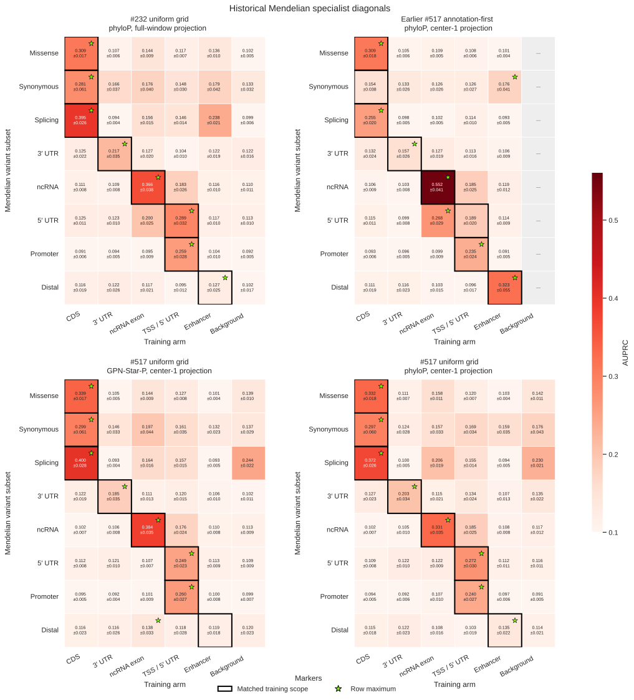

# Region-specific anchors for vertebrate specialists

> [!NOTE]
> **TL;DR:** Uniform phyloP-selected anchors recover the eight-subset specialist diagonal, while annotation-first ncRNA and centered enhancers perform better on their home subsets; these results support region-specific defaults at fixed compute, without isolating anchor geometry from exposure and projection-backend differences.

## Findings

Annotation-first construction did not recover a complete Mendelian specialist diagonal: the matched specialist had the highest AUPRC on six of eight subsets.
The enhancer specialist beat CDS on synonymous variants, and ncRNA beat the TSS/5′-UTR specialist on 5′-UTR variants.
Uniform-grid specialists achieved seven home-subset wins with GPN-Star-P entropy selection and eight with phyloP selection.
These are rankings of terminal point estimates, not eight statistically established pairwise wins.

The best observed construction depends on the region.
At matched training compute, uniform phyloP-selected windows improved splicing, synonymous, and 5′-UTR AUPRC relative to annotation-first construction, while annotation-first ncRNA and centered enhancers improved their home subsets.
Gonzalo Benegas therefore selected uniform-grid CDS, TSS/5′ UTR, and 3′ UTR; annotation-first ncRNA exons; and dELS/pELS-centered, exon-excluding enhancers as current defaults.
This recommendation combines existing specialist inputs; it is not a separately evaluated, jointly constructed hybrid catalog.

Reducing the uniform enhancer cohort from family to order representatives partially recovered Mendelian distal performance at fixed compute, but did not improve Complex Traits distal performance.
The intervention reduced species density and increased repetitions together, so it does not identify an exposure-only effect.

## Evidence

Validation language-modeling loss used 16,384 original-orientation rows sampled from each dataset before training-only reverse-complement augmentation.
The split was row-level, so projections of the same human anchor could occur in training and validation.
Terminal strict-phyloP validation losses were 1.08367 for CDS, 0.85712 for TSS/5′ UTR, 0.92517 for 3′ UTR, 0.92461 for ncRNA, and 1.27926 for enhancer; the order-control enhancer reached 1.282146.
Validation rows differ across recipes and regions, so these losses monitor the individual runs and do not rank anchor policies.
A matched cross-recipe validation-loss comparison is unavailable.

All models in the comparison are Qwen3-like 0.25B models evaluated at terminal step 4,999, using seed 0 and 5,000 steps of 8,192 sequences: 40,960,000 sequence presentations and approximately 10.49 billion tokens per arm.
The issue #517 family-cohort datasets use 107 mammal and 28 non-mammal projection targets plus human, 255-bp windows, and center-1 projection.
The uniform grid has 128-bp stride.
PhyloP training anchors require at least 51 of 255 bases with phyloP447way ≥2.2162; the GPN-Star-P experiment instead counts positions with calibrated primate-model entropy below 0.081001.

Mendelian evaluation uses the development split of odd-numbered autosomes and chromosome X, with complete mature-miRNA groups excluded and at least 30 positive match groups per displayed subset.
AUPRC is the primary metric, using the negative strand-averaged variant log-likelihood ratio.
The diagonal figure intentionally includes off-domain cells to test specialization; no pooled specialist score is used.

  

_Mendelian development AUPRC ±1 match-group bootstrap standard error, using 1,000 resamples.
Rows are grouped by their matched specialist to expose the diagonal; outlines mark that specialist and stars mark point-estimate row maxima.
Gray cells have no model.
The historical #232 panel uses full-window mammalian projection and is a same-size reference, not an isolated anchor-policy control._

For strict phyloP uniform minus annotation-first, the paired AUPRC differences were +0.116 for splicing (95% CI 0.077–0.163), +0.143 for synonymous (0.043–0.242), and +0.082 for 5′ UTR (0.054–0.120).
The ncRNA difference was −0.221 (−0.296 to −0.143), and distal was −0.188 (−0.280 to −0.093).
These intervals are unadjusted paired match-group bootstrap intervals.
Intervals for the smaller missense and 3′-UTR gains, and for promoter, include zero.
The eight-home-win phyloP matrix does not establish a general selector advantage over GPN-Star-P.

The fixed presentation budget gives different effective row epochs:

| Specialist | Annotation-first | phyloP uniform, family cohort |
| --- | ---: | ---: |
| CDS | 0.874 | 0.589 |
| TSS / 5′ UTR | 5.405 | 3.537 |
| 3′ UTR | 3.604 | 2.825 |
| ncRNA | 6.596 | 1.970 |
| Enhancer | 1.615 | 0.514 |

The order-control enhancer retained 40 sources, with human as the sole Primates representative and 39 non-human representatives across mammalian and non-mammalian orders.
Its 15,719,320 post-augmentation training rows received 2.606 effective epochs, compared with 0.514 for the 79,725,424-row family control.
Mendelian distal AUPRC rose from 0.135 ±0.022 SE to 0.235 ±0.050 on 58 positive match groups; the annotation-first enhancer remained higher at 0.323 ±0.055.
Complex Traits distal AUPRC changed from 0.109 ±0.006 to 0.104 ±0.005 on 616 positive match groups, using the absolute strand-averaged log-likelihood ratio.
The order-control uncertainties are marginal bootstrap standard errors; no paired difference test or seed replication establishes that contrast.

## Limitations

- The experiments match compute, not effective epochs, unique loci, functional-base density, or species representation.
  The centered enhancer result does not isolate centering, and the smaller ncRNA dataset received substantially more repetitions.
- Mammals use the same HAL center-1 contract, but non-mammals use direct MultiZ projection in the uniform release and UCSC pairwise chains in the annotation-first release.
  The small backend comparison found differences in mapping recovery and target-window placement, so these are not identical-backend controls.
- The complete diagonal is based on point estimates from one training seed and development data.
  AUPRC uncertainty reflects benchmark resampling, not training-seed variation; no held-out evaluation establishes generalization of the selected recipes.
- The initial question about when the diagonal emerges was deferred under the terminal-checkpoint-only evaluation decision.
- The newer background arm includes conserved windows rejected from the enhancer assignment and is not the same negative control as #232's background.

## Related questions

- [How should genomic anchors be selected and projected across species?](../questions/genomic-anchors.md)
- [Which genomic regions to train on, and how to find them?](../questions/training-regions.md)
- [How should evolutionary timescale shape training?](../questions/evolutionary-timescale.md)

## Research record

- [Experiment issue #517](https://github.com/Open-Athena/marin-dna/issues/517)
