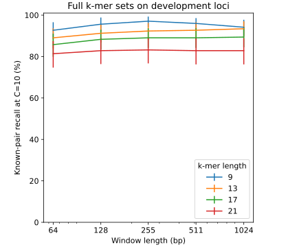
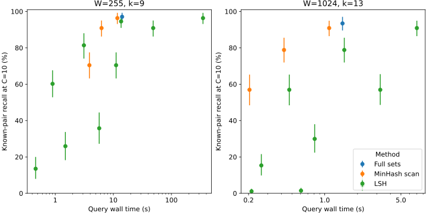

# Local k-mer retrieval of mammalian homologs

> [!NOTE]
> **TL;DR:** Complete local k-mer sets recover 97.1% of held-out mammalian homology pairs at ten candidate loci, but the tested MinHash/LSH settings do not improve the recall–runtime frontier over exact indexes; the study stops before conservation selection or training.

## Findings

The full-set similarity signal is useful for recovering known homologs in this bounded fixture.
The development-selected W255/k9 representation recovered 204 of 210 held-out physical locus pairs at ten unique candidates per query: 97.1% recall, with a 95% grouped-bootstrap interval of 94.9–99.1%.
This is evidence of local sequence similarity, not evidence that an entire retrieved window is evolutionarily constrained.

Do not advance the tested MinHash/LSH recipe to a conservation selector.
Every development LSH setting that passed the prespecified recall and injected-decoy thresholds was slower than an exact-index setting with equal or higher recall, and the frozen held-out comparisons retained that disadvantage.
A small development runtime tradeoff for exhaustive MinHash scanning did not persist against the frozen exact controls on held-out loci; sketch construction also raised total measured preparation-plus-query cost.
These are results for the sampled sketch sizes and implementations, not a general impossibility result for genomic sketching.

Window geometry and acceptance criteria remain separate limitations.
Local windows helped isolate short synthetic tracts, but denser tiling and a two-scale union did not improve aggregate held-out recall over the selected single scale.
Requiring a global match across an independently tiled window discarded many retrieved homologs, and similar target copies made the designated partner ambiguous.

## Evidence

The benchmark regenerated #521's 128 human/mouse/armadillo homology controls from pinned projection inputs, added 128 anchors, and expanded every projected center to a 4,096 bp genomic context.
The original assemblies were retained, and all 768 central 255 bp sequences matched their source projections up to reverse complement.
The fixed target universe included 3,000 random genomic contexts, 768 contexts matched for GC, repeat fraction, and coarse sequence complexity, 192 repeat-rich challenges, and 768 injected shuffled decoys.

Homologs and overlapping contexts were assigned together to 87 development and 65 held-out split groups before tuning.
Queries and candidates were counted as physical loci connected by within-species genomic overlap; disjoint homologous intervals remained separate candidates.
Recall counted every known source-locus/target-locus pair, with each query spending its candidate budget once.
The primary budget was ten unique candidate loci per query, with one and 100 also reported.
The held-out evaluation comprised 210 known pairs from 204 queries in 65 split groups.
Confidence intervals resampled split groups 2,000 times with a fixed seed; the many secondary controls are descriptive comparisons, not a new held-out selection procedure.

The development screen crossed five window lengths (64, 128, 255, 511, and 1,024 bp) with four canonical k-mer lengths (9, 13, 17, and 21) at half-window stride.
Full, half, and quarter strides, repeat masking, whole-context scoring, and a budget-preserving scale union were follow-up controls.
Each setting covered the same contexts, used independent species/contig tiling phases, and skipped k-mers spanning ambiguous bases.
Complete-set Jaccard scores used an exact inverted index; MinHash scans and compatible banded LSH used the same input windows and candidate universe.
Matched Linclust included its intrinsic alignment filtering, while a separate edit-distance diagnostic measured the loss from requiring a full-window match after exact retrieval.

  

_Development known-pair recall at ten unique candidates; 274 pairs in 87 split groups, complete canonical k-mer sets, and half-window stride.
Error bars are 95% percentile intervals from 2,000 split-group bootstrap resamples.
The selected width is a study choice, not an established optimum._

| Frozen held-out setting | Recall at C=10 (95% CI) | Query time (s) | Cold stages (s) | Index (MB) |
|---|---:|---:|---:|---:|
| Full sets, W255/k9 | 97.1% (94.9–99.1) | 11.67 | 25.0 | 221.4 |
| MinHash scan, W255/k9, H512 | 95.7% (92.5–98.5) | 9.65 | 66.7 | 463.5 |
| LSH, W255/k9, H512, r2 | 95.7% (92.4–98.5) | 11.32 | 71.8 | 811.1 |
| Linclust, W255 | 42.4% (36.6–49.3) | 0.18 | — | — |
| Full sets, W511/k9 | 97.1% (94.7–99.1) | 7.82 | 21.2 | 224.5 |
| Full sets, W1024/k13 | 95.2% (91.8–98.0) | 1.27 | 15.1 | 346.9 |
| MinHash scan, W1024/k13, H512 | 90.0% (85.3–94.0) | 0.95 | 62.7 | 116.2 |
| LSH, W1024/k13, H512, r1 | 90.0% (85.3–94.0) | 6.05 | 69.0 | 290.5 |
| LSH, W1024/k13, H512, r2 | 51.0% (42.4–60.0) | 2.54 | 65.1 | 203.3 |
| Linclust, W1024 | 18.1% (12.0–25.1) | 0.07 | — | — |
| Full sets, W4096/k13 | 96.7% (94.0–98.7) | 0.80 | 12.0 | 238.8 |

All tabulated settings use half-window stride; W4096 scores each entire context once.
Cold-stage sums add feature, uncached sketch, and index construction to query time, excluding cache/prediction serialization.
Linclust's unprofiled FASTA export prevents a complete comparable cold-stage figure; its query time is conditional on clustering already having run.
Index MB are decimal bytes for both target species' postings or signatures plus bucket arrays; they exclude shared window metadata and are not process memory.

  

_Development query time against prepared indexes, with W and k fixed within each panel.
MinHash signatures contain 32, 128, or 512 affine64 permutation minima; LSH crosses those sizes with one, two, or four rows per band and rescores the retrieved signatures.
Error bars use the same grouped bootstrap; runtime uncertainty was not estimated.
The full exact baseline matrix, including other window/k settings, determines the recall–runtime frontier._

At W255/k9, full-, half-, and quarter-window strides gave 95.7%, 97.1%, and 97.1% held-out recall, with 90,086, 169,817, and 331,134 total input windows and 5.35, 11.67, and 33.25 seconds of query work.
The frozen scale union reached 96.7% while paying both retrieval costs.
For W1024/k13, masking raised recall from 95.2% to 96.7% and cut query time from 1.27 to 0.49 seconds, but increased the injected shuffled-decoy share of top-ten candidates from 0.54% to 7.84%.
Unmasked W255/k9 had a 0.64% shuffled-decoy share; its species-pair recalls were 97.2% for human/mouse, 100% for human/armadillo, and 94.3% for mouse/armadillo.
The 24 known pairs in majority-repeat query contexts had 83.3% recall, with a wide 66.7–96.0% interval.

A separate global-edit-distance gate, allowing at most 30% edits across the best-scoring full window in either orientation, reduced held-out recall at ten candidates to 31.0% at W255 and 13.8% at W1024.
The C=100 profiles made 40,800 strand-specific alignment calls per setting and took 7.41 or 6.35 seconds after approximately 11 seconds of feature preparation.
They did not backfill candidates and are not a general ceiling on local alignment sensitivity.

Synthetic controls planted 32–1,024 bp tracts in independent 4,096 bp flanks, with target-branch substitution probabilities of 0%, 15%, or 30% and indel probabilities of 0% or 3%.
At k=9, W255 recovered 67.1% of the 216 designated pairs at ten candidates, versus 53.2% for whole-context scoring.
For 32 bp tracts, the corresponding recalls were 41.7% and 22.2%; at W255, increasing the target-branch substitution probability from 0% to 30% reduced aggregate recall from 100% to 34.7%.
The mouse/armadillo pair accumulated independent mutations on both branches, so this probability is not its pairwise divergence.
Adding ten similarly mutated target copies per locus reduced W255/k9 recovery of the designated partner at one candidate from 62.5% to 9.3%.
Those copies are competing homologs, so the result demonstrates partner ambiguity rather than validated false-positive retrieval.

## Limitations

These are projected homology controls, not labels of evolutionary constraint or conservation across each entire context.
The target universe is small and enriched for known partners; unannotated genomic hits are unresolved, so shuffled-decoy contamination is not validated precision.
The background contexts do not provide an unbiased set of independently annotated query homologs for a conservation-enrichment test.
GC and repeat fractions were closely matched, but three-mer richness largely saturated in these long contexts and did not provide a strong complexity control.
The study did not stratify by annotated repeat family, and the duplicated synthetic tracts are paralog-like competitors rather than curated biological paralogs.

The synthetic mutation grid has two replicates per setting and serves as a mechanism check.
The real benchmark covers three mammals and partly reuses the earlier control cohort; it does not establish a result for distant species or whole genomes.
Timings describe these implementations on one 16-vCPU EC2 worker, with a single timing per setting; runtime variation and production scaling were not measured.
The MinHash scan used eight threads, while exact sparse scoring and Python LSH orchestration used one.
Peak Python memory and external MMseqs2 memory were measured separately, and cached construction was separated from query time.
No genome-scale index, conservation selector, or training comparison was run.

## Related questions

- [Which genomic regions to train on, and how to find them?](../questions/training-regions.md)

## Research record

- [Experiment #568](https://github.com/Open-Athena/marin-dna/issues/568)
