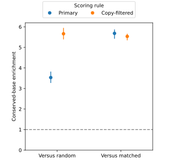
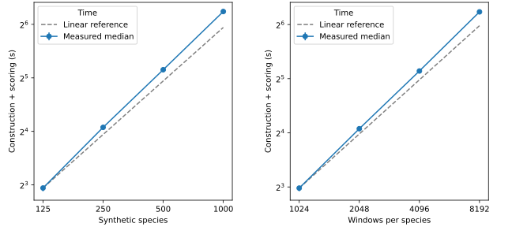

# Local conservation scores from species k-mer prevalence

> [!NOTE]
> **TL;DR:** Shared DNA words from three mammals identify 100 bp human intervals enriched for conservation; copy filtering raises conserved-base density to 23.4% at a 5% selection budget, while global-index memory remains a separate scaling constraint.

## Findings

Three genomes provide measurable conservation signal at 100 bp resolution.
On the held-out human chromosome, the primary score enriches selected bases 3.53× over random and 5.68× over composition-matched selection, passing the predefined biological criterion.
A secondary copy-filtered score yields higher absolute conserved-base density: 23.4%, versus 14.6% for the primary score and 4.13% across eligible sequence.
This supports a local conservation proxy; it does not establish a calibrated probability of functional constraint or a training benefit.

## Evidence

The method treats a DNA word and its reverse complement as the same word, samples one quarter of words by a deterministic hash, and counts distinct-species support.
Each species contributes at most once per word; a second pass scores each complete nonoverlapping 100 bp interval.
The pilot scores human chromosomes 1 and 2 against complete human, mouse, and armadillo references totaling 9.66 billion bases.
Its index retains only query-chromosome words but counts their species support and copies across every complete input genome.
Labels never enter the index, and no pair list or alignment is constructed.

Chromosome 1 selected 25-letter words and the fraction present in either other genome from three word lengths and six scoring rules, maximizing composition-matched enrichment.
After inspecting development results, a secondary setting maximizing absolute conserved-base density was also frozen: the same score with contributions suppressed for words appearing more than four times in any input genome.
The denominator still includes all sampled distinct words.
Both choices were published before chromosome 2 was evaluated, and the original primary criterion remained unchanged.

Evaluation reuses the vertebrate-projection pipeline's phyloP447way bigWig and inclusive phyloP >= 2.2162 definition.
Missing values count as non-conserved over the full interval; eligible intervals require at least 95% valid DNA.
The held-out set contains 2,405,464 intervals, with 12,027,300 bases selected at the 5% budget.
Matched random selection preserves the selected set's coarse GC, soft-mask, and single-base-entropy strata.

| Held-out measure at 5% selected bases | Primary | Copy-filtered secondary |
| --- | ---: | ---: |
| Conserved bases among selected bases | 14.6% | 23.4% |
| Enrichment versus random (95% CI) | 3.53 (3.27–3.82) | 5.66 (5.39–5.95) |
| Enrichment versus matched (95% CI) | 5.68 (5.42–5.87) | 5.53 (5.35–5.66) |
| Recall of annotated conserved bases | 17.7% | 28.3% |

At the same budget, low-repeat, high-entropy, and high-GC baselines contain 8.16%, 3.62%, and 5.41% conserved bases.
At the prespecified secondary 1% budget, copy-filtered selection contains 60.1% conserved bases and recovers 14.5% of all annotated conserved bases.
This improves specificity while selecting fewer conserved bases overall.
Directly adjacent selected bins merge into stretches without bridging unselected or invalid intervals.

  

_Enrichment among the selected 5% of eligible chromosome-2 intervals.
Error bars are 95% percentile intervals from 200 bootstrap resamples of approximately 1 Mb genomic blocks, reranking to the same selected-base fraction in each resample._

The selected k25 query index took 421.4 seconds to construct and 65.4 seconds to score 4,911,499 intervals across both query chromosomes, with 5.77 GiB peak RSS and a 1.62 GB serialized index.
These are single-process measurements on a 16-vCPU, 32-GiB EC2 worker, excluding download, sequence preparation, evaluation, and selection.

With fixed interval length, aggregate counting and scoring require expected O(B) work in total bases B and O(U) memory for distinct sampled words U.
Fixed-budget partition selection and joining neighboring bins avoid a global ranking sort, adding O(M) space for M interval scores.
The combined expected bound is O(B + M) work and O(U + M) space.
The biological pilot uses query-chromosome U; the separate global-index benchmark scores all synthetic species.

In 21 timing runs, increasing species count eightfold at fixed intervals per species increased median time 9.84× and peak RSS 8.00×.
Increasing intervals per species eightfold at fixed species count increased median time 9.55× and peak RSS 8.00×.
The largest shape, 1,000 synthetic species × 2,048 intervals, processed 204.8 million bases in a median 75.59 seconds, using 2.84 GiB peak RSS and an 819 MB index.

  

_Medians and minimum-to-maximum ranges over three repetitions per shape, using one CPU process, uniform synthetic DNA, 100 bp intervals, and one-quarter sampling.
The species axis fixes 2,048 intervals per species; the interval axis fixes 250 species.
Download, preparation, scientific evaluation, and fixed-budget selection are excluded.
Synthetic inputs test resources only._

A naive constant-throughput and distinct-word-rate extrapolation to one billion 100 bp intervals gives approximately 10.3 single-process hours, a 400 GB index, and 1.49 TB peak RSS for construction and scoring.
This is an unvalidated planning extrapolation, not a production measurement; real genome repetition, divergence, cache behavior, and storage can change all three.
At 100 bp resolution, 1,000 human-sized 3 Gb genomes would contain approximately 30 billion intervals, not one billion.

## Limitations

Biological accuracy is measured on one held-out human chromosome with three mammalian genomes and alignment-derived conservation labels.
It does not establish accuracy across 1,000 real genomes.
Species counts are unweighted by evolutionary distance, and shared words can reflect repeats, paralogs, or chance matches.
The controls match coarse composition, not repeat families; the copy-filtered selected set remains 51.4% soft-masked, and repeat families can span the chromosome split.

The query-restricted memory result does not describe an index over every genome.
A global exact index stores 16 bytes per sampled distinct word on disk and requires additional hash-table memory; linear growth can still exceed practical RAM limits.
Rescanning all genomes for each bounded query batch introduces an additional batch-count factor; a disk-partitioned global implementation was not tested.
Word matches can extend up to 24 bases upstream of their assigned interval, and boundaries lie on a 100 bp grid.
Fixed selected-base budgets produce ranked candidate stretches, not an absolute conservation threshold transferable to another species panel.

## Related questions

- [Which genomic regions to train on, and how to find them?](../questions/training-regions.md)

## Research record

- [Experiment issue #577](https://github.com/Open-Athena/marin-dna/issues/577)
