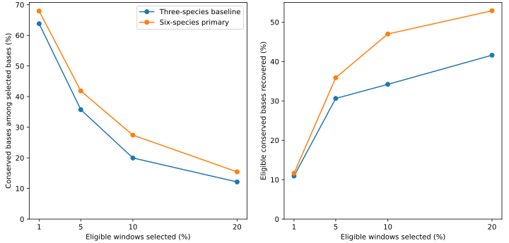
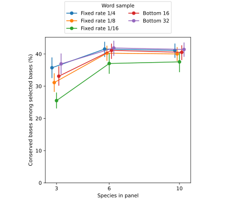
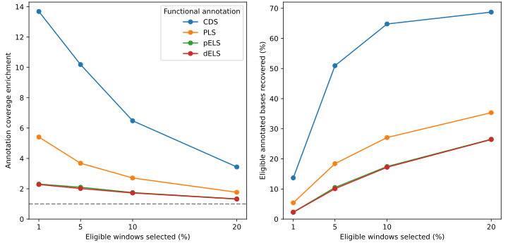
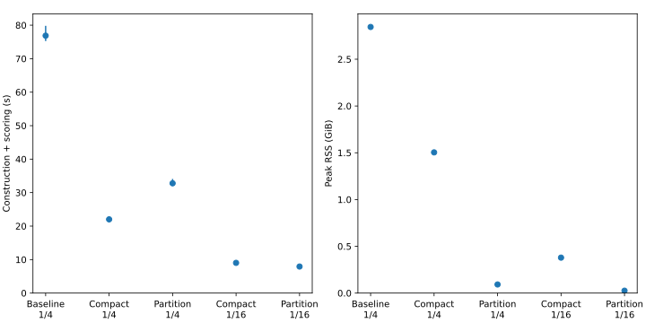

# Local conservation scores from species k-mer prevalence

> [!NOTE]
> **TL;DR:** After excluding repeat-rich windows, a six-mammal shared-word score selects 5% of eligible human bases containing 41.9% conserved bases versus 35.7% for three mammals; quarter-rate sampling performs almost as well as MinHash at half the query-index peak RAM.

## Findings

The frozen six-mammal method raises conserved-base density by 6.14 percentage points on fresh human chromosome 4, with a paired 95% interval of 5.19–6.90 points.
Its selected bases contain 41.87% conservation, compared with 35.73% for the frozen three-mammal comparator and 5.83% across eligible sequence.
The result supports ranking candidate conserved stretches for training-region selection.
It does not establish a calibrated probability of functional constraint or a demonstrated training benefit.

Exact disk partitions score three complete genomes and select candidate stretches in 23.53 minutes at 1.42 GiB peak RSS.
This demonstrates bounded resident memory on the tested corpus, while total word diversity and temporary disk usage still grow with input.

## Evidence

The method counts how many complete genomes contain each sampled 25-letter DNA word, treating a word and its reverse complement as equivalent.
Each species contributes at most once to prevalence.
An optional copy filter suppresses contributions from words appearing more than four times in any genome, while keeping them in the score denominator.
Scores summarize other-species support locally within nonoverlapping 100 bp intervals; no window pairs, groups, or alignments are constructed.
Adjacent selected intervals merge into candidate stretches without bridging unselected intervals.

The training-region policy excludes windows with more than 20% lowercase sequence and requires at least 95% ACGT.
Every word touching lowercase is excluded in both query and support genomes.
Uppercase support elsewhere remains usable even if its surrounding window is excluded from output selection.
This is an explicit repeat-exclusion policy for the intended training corpus, not a claim that repeats lack biological conservation.

Evaluation reuses the vertebrate-projection pipeline's phyloP447way bigWig, with the inclusive phyloP >= 2.2162 definition.
Missing values and lowercase bases count as non-conserved over the full 100 bp denominator.
The main endpoint is conserved-base density within a fixed 5% of eligible bases; 1% and 10% budgets are prespecified secondary summaries.
Coarse GC, repeat-fraction, and single-base-entropy strata define composition-matched controls.
Labels never enter the word index.

The comparison tests nested panels of 3, 6, and 10 complete mammalian genomes, totaling 28.15 billion bases at ten species.
It compares deterministic word sampling at 1/4, 1/8, and 1/16 with the smallest 16 or 32 word hashes per interval.
For MinHash, selected query words are counted against every unmasked word in complete support genomes, including words absent from support sketches.
The query index retains only words needed for the evaluated chromosomes, while preserving their exact global counts.

Chromosome 1 selected one of six scoring rules for each panel/sampling setting and an overall winner by conserved-base density.
All fifteen choices were published before accessing fresh chromosome-4 labels.
Earlier chromosome-2 and chromosome-3 evaluations retain their original repeat-inclusive definitions and do not estimate performance on this eligible population.

The held-out cohort contains 799,540 intervals, and the 5% budget selects 3,997,700 bases.
The primary averages copy-filtered other-species prevalence; the fixed three-species comparator measures copy-filtered support from any other species.

| Fresh chromosome-4 measure at 5% selected bases | Three-species baseline | Six-species MinHash |
| --- | ---: | ---: |
| Conserved bases among selected bases | 35.73% | 41.87% |
| Recall of eligible annotated conserved bases | 30.63% | 35.89% |
| Enrichment versus random | 6.13× | 7.18× |
| Enrichment versus composition-matched selection | 5.71× | 6.59× |

| Eligible windows selected | Conserved-base density | Conserved-base recall | Selected windows with zero score |
| --- | ---: | ---: | ---: |
| 1% | 67.94% | 11.65% | 0.0% |
| 5% | 41.87% | 35.89% | 0.0% |
| 10% | 27.41% | 47.00% | 14.0% |
| 20% | 15.42% | 52.89% | 57.0% |

Only 68,795 of 799,540 eligible intervals (8.60%) have positive primary scores.
Above that fraction, a deterministic coordinate-hash tie-break fills the budget with zero-score windows; the score does not rank those windows by conservation.
The 20% budget was requested after validation and is a descriptive follow-up with unchanged frozen choices.

  

_Complete held-out chromosome-4 measurements for the two frozen scores at 1%, 5%, 10%, and 20% selection.
Curves connect descriptive measurements; no uncertainty intervals are shown for this whole-cohort budget summary.
Zero-score tie filling accounts for 14.0% and 57.0% of primary selections at 10% and 20%._

  

_Conserved-base density among the selected 5% of eligible chromosome-4 bases.
Each scoring rule was selected on chromosome 1 and frozen before validation.
Bars show 95% percentile intervals from 200 resamples of approximately 1 Mb genomic blocks.
The primary-versus-baseline contrast uses paired resamples; sampling methods retain different numbers of words._

MinHash supplies only a small point-estimate gain on the same six-genome panel: bottom-32 reaches 41.87% density versus 41.53% for quarter-rate sampling, with standalone query-index peaks of 3.01 versus 1.51 GiB.
Eighth-rate sampling reaches 40.24% at 0.76 GiB, and bottom-16 reaches 41.13% at 1.51 GiB.
The comparison uses different word budgets; hash-table allocation boundaries also affect peak RSS.
Adding the four additional genomes does not improve the bottom-32 point estimate (41.41%), and the primary remains the setting selected before validation.

Functional annotation overlaps use the existing GTF and cCRE assets, independent of the window-selection rule.
CDS enrichment is much stronger than enhancer enrichment.
PLS denotes promoter-like signatures; pELS and dELS denote proximal and distal enhancer-like signatures.
Recall below is the fraction of each annotation's bases inside eligible windows that is selected, not element-level recall.

| Annotation | Enrichment at 5% | Recall at 5% | Recall at 10% | Recall at 20% |
| --- | ---: | ---: | ---: | ---: |
| CDS | 10.19× | 50.93% | 64.80% | 68.73% |
| PLS | 3.68× | 18.40% | 27.09% | 35.34% |
| pELS | 2.10× | 10.50% | 17.47% | 26.53% |
| dELS | 2.02× | 10.08% | 17.21% | 26.42% |

  

_Descriptive base-overlap measurements for the frozen six-species primary on eligible chromosome-4 sequence.
Enrichment divides the annotation fraction among selected bases by its fraction among all eligible bases.
Annotations can overlap, and the complete 100 bp bins contribute to the denominator.
Larger budgets include zero-score ties once the positive score population is exhausted; they do not demonstrate additional ranking sensitivity._

A planted-tract diagnostic exposes the sensitivity limit of exact words.
With 150 bp tracts, 1% indels, and quarter-rate copy-filtered scoring, any-positive-evidence detection falls from 19/20 replicates at 5% substitutions to 16/20 at 10% and 2/20 at 20%.
These are exploratory synthetic detection rates, not calibrated biological recall at the selection budget.

For total bases B, output intervals M, and distinct sampled words U, fixed-width aggregate counting and scoring require expected O(B + M) work.
At fixed window length this is linear in both windows per species and species count.
An in-memory index needs O(U) state; keeping all scores for selection adds O(M).
The disk implementation partitions word records during one input scan, counts each partition exactly, and assembles scores in bounded chunks.
With P balanced partitions and C intervals per chunk, resident state is O(U/P + C + P); disk traffic remains proportional to sampled occurrences and partial scores.
The exact streaming selector adds linear work, a per-species score histogram, and disk-backed threshold-tie resolution.
For the any-species score at fixed width, the finite set of possible score fractions bounds histogram size independently of genome length.

Across three complete genomes totaling 9.66 billion bases, masked quarter-rate disk counting and scoring produce 96,574,572 interval rows in 19.74 minutes at 1.42 GiB peak RSS.
Exact per-species 5% selection adds 3.79 minutes at 19.5 MiB peak RSS, for 23.53 minutes combined.
All 4,391,709 corresponding human query rows match the independently built query-index output.
The 817.75 million distinct sampled words occupy 32 partitions; word records total 13.79 GB, interval metadata 4.62 GB, and partial-score records 0.19 GB, plus a 5.82 GB score table.
Those are component sizes, not a measured simultaneous disk peak.
The prior repeat-inclusive run of the same genomes takes 47.94 minutes combined at 3.02 GiB scoring peak RSS.

Fixed budgets can exhaust the positive signal: the three-species mouse output fills 149,944 of 439,818 selected intervals with zero-score ties.
That output demonstrates resource behavior and exact selection, not validated mouse conservation.

The repeated synthetic comparison separates storage effects from biological sequence composition.
At 1,000 species × 2,048 intervals, quarter-rate construction and scoring take a median 76.87 seconds and 2.84 GiB peak RSS for the original index, 22.02 seconds and 1.50 GiB for the compact index, and 32.79 seconds and 94.2 MiB for 32 disk partitions.
All quarter-rate outputs match the complete original score tables.
One-sixteenth sampling reduces partitioned runtime to 7.92 seconds and peak RSS to 25.9 MiB.
Eightfold input growth takes approximately ten times as long for the in-memory methods and fifteen times as long for quarter-rate disk partitioning on both tested axes.
Expected linear hash work therefore does not establish constant-throughput production scaling.

  

_Medians and minimum-to-maximum ranges over three repetitions on 1,000 synthetic species × 2,048 intervals, totaling 204.8 million bases.
Each run uses one CPU process on the same worker.
The matrix independently varies species and intervals per species and checks all quarter-rate scores against the complete baseline tables.
These measurements exclude biological evaluation and final selection; the real-genome measurement above includes selection._

## Limitations

Biological validation uses held-out human chromosomes and alignment-derived annotations.
The support genomes can overlap the phyloP alignment panel; this is not independent functional validation or evidence of accuracy across 1,000 real genomes.
Panel size, species composition, and development-selected score change together, so their individual contributions are not isolated.
Species counts are unweighted by evolutionary distance; paralogs, unmasked repeats, and chance matches can still contribute.
Soft masks and assembly auxiliary sequences can change both eligibility and the copy filter.
The ten-species query comparison and three-species global resource trial measure different settings.

Linear work does not imply small storage.
Global word diversity, disk traffic, and output size grow with the corpus; the current partition implementation assumes balanced shards, allows at most 512 partitions, and does not recursively split an oversized shard.
At 100 bp resolution, 1,000 human-sized 3 Gb genomes contain about 30 billion intervals before exclusions.
Query-index memory measurements cannot be substituted for global-index measurements.

Exact 25-letter matches lose sensitivity with divergence.
Matches can extend up to 24 bases upstream of their assigned interval, and boundaries lie on a 100 bp grid.
Fixed selection budgets do not establish an absolute conservation threshold transferable to another species panel.
The primary cannot meaningfully rank the 91.4% of eligible chr4 windows tied at zero; expanded coverage beyond 8.6% therefore requires more sensitive evidence or an explicitly unranked background sample.
Annotation overlaps and planted-tract diagnostics do not establish training value.

## Related questions

- [Which genomic regions to train on, and how to find them?](../questions/training-regions.md)

## Research record

- [Experiment issue #577](https://github.com/Open-Athena/marin-dna/issues/577)
