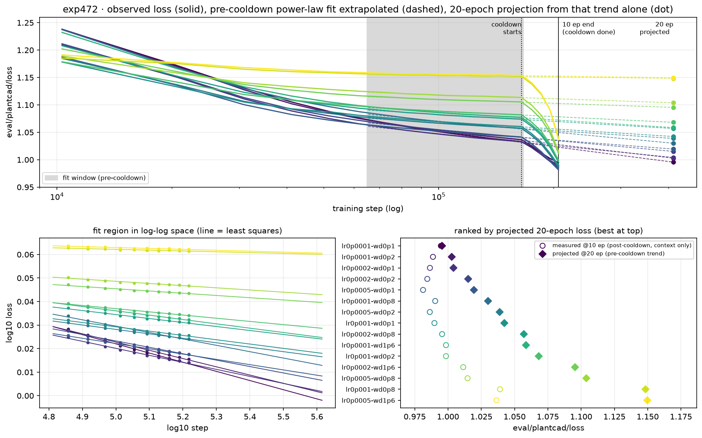

# exp472 — loss trend fits and 20-epoch projection

Each of the 15 completed trials (the abandoned `lr0p001-wd1p6` is excluded) was fit
with a power law, `log10(loss) = a·log10(step) + b`, over the **pre-cooldown window
steps 64,916 → 164,928** — 10 eval points, ending at the last eval at or next to the
start of cooldown (step 164,916 = 80% of 206,145, from `decay=0.2`). That fitted line
is extrapolated to **step 412,290**, i.e. 10 more epochs at 20,614.5 steps/epoch.

**Post-cooldown evals take no part in the fit or the projection.** They are shown in
the plot and in the last column for context only.

| # | run (lr / wd) | fit slope | R² | **projected loss @20 ep** | measured @10 ep † |
|---:|---|---:|---:|---:|---:|
| 1 | `lr0p0001-wd0p1` | -0.0390 | 0.993 | **0.9955** | 0.9947 |
| 2 | `lr0p0001-wd0p2` | -0.0351 | 0.994 | **1.0028** | 0.9887 |
| 3 | `lr0p0002-wd0p1` | -0.0298 | 0.993 | **1.0041** | 0.9864 |
| 4 | `lr0p0002-wd0p2` | -0.0272 | 0.996 | **1.0151** | 0.9844 |
| 5 | `lr0p0005-wd0p1` | -0.0224 | 0.996 | **1.0194** | 0.9813 |
| 6 | `lr0p0001-wd0p8` | -0.0271 | 0.988 | **1.0301** | 0.9904 |
| 7 | `lr0p0005-wd0p2` | -0.0189 | 0.995 | **1.0388** | 0.9863 |
| 8 | `lr0p001-wd0p1` | -0.0183 | 0.994 | **1.0423** | 0.9898 |
| 9 | `lr0p0002-wd0p8` | -0.0169 | 0.989 | **1.0569** | 0.9956 |
| 10 | `lr0p0001-wd1p6` | -0.0184 | 0.989 | **1.0586** | 0.9985 |
| 11 | `lr0p001-wd0p2` | -0.0136 | 0.993 | **1.0682** | 0.9985 |
| 12 | `lr0p0002-wd1p6` | -0.0095 | 0.975 | **1.0954** | 1.0114 |
| 13 | `lr0p0005-wd0p8` | -0.0092 | 0.967 | **1.1039** | 1.0147 |
| 14 | `lr0p001-wd0p8` | -0.0034 | 0.914 | **1.1483** | 1.0390 |
| 15 | `lr0p0005-wd1p6` | -0.0039 | 0.925 | **1.1497** | 1.0364 |

† Post-cooldown, so **not comparable in level** to the projection: the projected value
is a point on the constant-LR trend, whereas the measured value has already taken the
cooldown drop (worth roughly −0.04 to −0.12 here). A real 20-epoch run ending in its own
cooldown would finish below its projection. Compare projections to each other, not to
column six.

## Which runs are best

- **`lr=1e-4/wd=0.1` is the clear leader** at 0.9955, ahead of `lr=1e-4/wd=0.2` (1.0028)
  and `lr=2e-4/wd=0.1` (1.0041). It has the steepest trend in the sweep (−0.0390) and is
  the furthest from flattening out.
- **Low LR and low WD both help, and they compound.** The five best projections are exactly
  `lr ≤ 2e-4` with `wd ≤ 0.2`, plus `lr=5e-4/wd=0.1`.
- **The 10-epoch ranking inverts.** `lr=5e-4/wd=0.1` has the best measured loss today
  (0.9813) but ranks only 5th on trend; `lr=1e-4/wd=0.1` has the *worst* measured loss of
  the leading group (0.9947) and the best trajectory. Higher LR buys a better model at
  10 epochs and a worse one thereafter.
- **High weight decay at high LR is finished.** `lr=1e-3/wd=0.8` and `lr=5e-4/wd=1.6` are
  flat (slope ≈ −0.003) with the weakest fits (R² 0.91–0.93). More epochs will not help them.

## Caveats

- A 2× extrapolation from a 10-point window: treat gaps below ~0.005 as noise. Ranks 2–3
  and 14–15 are within that.
- The fit assumes the constant-LR power law continues; it cannot see a future cooldown.
- `eval/plantcad/loss` spans only ~0.95–1.25 over the logged range, so the plot uses a
  linear y-axis with a log x-axis rather than a broken or multi-scale axis.

Reproduce with `uv run --with matplotlib python project_loss.py`.
Source: W&B `eric-czech/marin`, key `eval/plantcad/loss`, 20 eval points per run.
