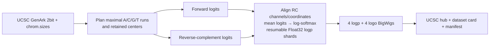

# Chinchilla m5.1 predictive sequence-logo pipeline

This experimental pipeline implements [issue #419](https://github.com/Open-Athena/marin-dna/issues/419): score the UCSC/NCBI RefSeq chinchilla assembly `GCF_000276665.1` with the public MarinDNA m5.1 checkpoint and build a native UCSC sequence-logo track. It is intentionally retained on its dedicated issue branch and is not planned for `main`.

The output is a **two-pass predictive sequence logo**. It is not an LLR logo, mutation-effect score, or constraint score. Every context window has exactly two logical model inputs: the forward reference sequence and its reverse complement.

## Pipeline



All genomic coordinates are 0-based, half-open. The default production proposal uses 255-bp contexts, a 128-bp stride, and window-relative retained interval `[63, 191)`. Adjacent regular retained centers abut. A tail context anchored at `run_end - 255` emits only positions not already emitted, so every planned scoreable base appears exactly once.

Only maximal case-insensitive A/C/G/T runs are tiled. Assembly gaps and other IUPAC bases are absent from the BigWigs. Runs shorter than 255 bp and the 63/64-bp context margins at scoreable-run boundaries are also absent, rather than represented by zero.

## Reproducible dry-run

Always dry-run before any real invocation:

```bash
uv run snakemake \
  --snakefile snakemake/analysis/chinchilla_logo/workflow/Snakefile \
  --directory snakemake/analysis/chinchilla_logo \
  --dry-run
```

The workflow-local default profile supplies `cores` and `use-conda`; do not duplicate those settings on the command line.

The default configuration selects only the largest scaffold, `NW_004955402.1`, for the Stage 2 benchmark. A real invocation downloads roughly 600 MB of UCSC 2bit sequence, expands the assembly to FASTA, and performs paid GPU inference. Obtain explicit approval before launching that work or any SkyPilot resource.

After approval, the complete configured target is:

```bash
uv run snakemake \
  --snakefile snakemake/analysis/chinchilla_logo/workflow/Snakefile \
  --directory snakemake/analysis/chinchilla_logo
```

### Stage 2 A10G benchmark

The checked-in SkyPilot task pins an on-demand AWS `g5.xlarge` (one A10G) in
`us-east-2` with a 250 GB disk. It records five-second GPU utilization/VRAM/power
samples, the cluster dry-run, `/usr/bin/time` process statistics, per-shard
inference timings, and BigWig construction time/file sizes. Before the full
scaffold run, it compares batch sizes 64 and 128 and DataLoader worker counts 2
and 4 on the same 16,384-window sample. The first 4,096-window chunk captures
compilation and warm-up; the remaining three chunks provide the steady-state
throughput comparison.

Commit and push first so the manifest and dataset card can cite the exact code,
then launch from the repository root:

```bash
sky launch -c chinchilla-logo-a10g \
  snakemake/analysis/chinchilla_logo/sky/run_a10g.yaml \
  --env COMMIT_SHA=$(git rev-parse HEAD)
```

Watch the new configuration actively during startup and early inference:

```bash
sky logs chinchilla-logo-a10g --follow
sky exec chinchilla-logo-a10g nvidia-smi
```

The task intentionally leaves the cluster available so results can be copied
back before teardown. Retrieve `results/benchmark`, `results/plans`,
`results/shards`, and `results/release`, verify them locally, then explicitly
terminate the cluster to stop compute charges.

### Lambda GH200 cost calibration

`sky/run_gh200_benchmark.yaml` measures the same m5.1 two-pass scoring path on
one on-demand Lambda GH200 without running the full scaffold. It fetches a
2 Mb prefix of `NW_004955402.1` through UCSC's sequence API, plans canonical
windows with the production tiling code, and scores 8,192 windows (about
1.05 million retained bases) per configuration. The primary configuration
matches the VEP evaluation default: batch size 128, four DataLoader workers,
BF16 evaluation, and `torch.compile`. Batch size 256 and eight workers are
execution-only neighbors that test whether the larger GH200 benefits from more
device or input parallelism.
The task pins NVIDIA's official `26.06-py3` multi-architecture PyTorch
container so the GH200's ARM64 CUDA runtime and PyTorch build are explicit and
reproducible.

Launch only after explicit paid-compute approval:

```bash
sky launch -c chinchilla-logo-gh200-bench \
  snakemake/analysis/chinchilla_logo/sky/run_gh200_benchmark.yaml \
  --env COMMIT_SHA=$(git rev-parse HEAD)
```

Copy `results/benchmark/gh200` back after the run, then terminate the cluster.

### Full-assembly GH200 production run

`sky/run_gh200_full.yaml` pins Lambda `us-east-3`, scores every sequence in
the UCSC `chrom.sizes` inventory, and builds the eight BigWigs and UCSC hub on the same
GH200. It keeps one model, tokenizer, and indexed genome handle resident across
scaffolds. The measured production configuration is batch size 128,
four DataLoader workers, BF16 evaluation, and `torch.compile`.

Full-DAG parsing needs the downloaded `chrom.sizes` inventory. The Sky task
therefore fetches that small target with the default configuration, performs a
full-assembly dry-run, and only then invokes the real workflow with
`config/full_genome.yaml`. Completed score shards are written directly through
the GH200 node's local disk, so a retry on the same node at the same application
commit validates and resumes them rather than starting inference over. Lambda
does not provide AWS credentials to SkyPilot's cross-cloud S3 mount; local
shards are therefore not durable if the node is destroyed before completion.

After explicit paid-compute approval, commit and push the exact code first,
then launch from the repository root:

```bash
sky launch -c chinchilla-logo-gh200-full --detach-run \
  snakemake/analysis/chinchilla_logo/sky/run_gh200_full.yaml \
  --env COMMIT_SHA=$(git rev-parse HEAD)
```

The run-specific local root is `~/.issue419/full-runs/<commit>/`. It contains
live GPU and Snakemake logs, resumable score shards, plans, the validated
release tree, a file-size inventory, and `COMPLETE.json`. Leave automatic
teardown disabled until the release has been relayed and verified. After the
job succeeds, run from the AWS-authenticated controller:

```bash
scripts/issue419_relay_gh200_release.sh \
  chinchilla-logo-gh200-full $(git rev-parse HEAD)
```

The relay streams each browser-facing release file through SSH, packages the
many small plans and logs into deterministic archives, and does not stage large
artifacts on the controller. It verifies every uploaded object size, publishes
SHA-256 sidecars for the archives, and uploads `COMPLETE.json` last. The durable
destination is
`s3://oa-bolinas/snakemake/analysis/chinchilla_logo/issue419-full/runs/<commit>/`.
Only tear the cluster down after the relay reports success. Resumable shards
remain local and are not uploaded.

For an unattended run, the watcher preserves the cluster after any job or relay
failure and tears it down only after a successful relay when `--down` is explicit:

```bash
scripts/issue419_watch_gh200_release.sh \
  chinchilla-logo-gh200-full JOB_ID COMMIT_SHA --down
```

There is no Hugging Face credential mount or upload step.

## Resumption and bounded memory

The default `score_scaffold` rule loads the pinned model once for one scaffold.
The full-assembly `score_scope` rule loads the model, tokenizer, and genome once
for the entire assembly, then scores each scaffold in fixed-size resumable
chunks. The existing Hugging Face `Trainer.predict` harness pads the last
physical batch and removes padded predictions, preserving one static compiled
shape.

Each completed chunk is written immediately under `results/shards/<scaffold>/part-*.npz`. The Snakemake output is a separate `.done.json` marker, so an interrupted rule retains validated chunks. On retry, shard coordinates and output-affecting metadata must exactly match the current plan before the chunk is skipped.

Shards store canonical Float32 log-probabilities plus window/emit offsets. Logo heights are deterministically reconstructed from `logp`, avoiding duplicate intermediate storage while preserving enough information to audit the exact context responsible for every published base.

## Outputs

```text
results/release/
├── README.md
├── bigwig/
│   ├── logprob/{A,C,G,T}.bw
│   └── logo/{A,C,G,T}.bw
├── manifest/release.json
└── ucsc/
    ├── hub.txt
    ├── genomes.txt
    ├── description.html
    └── GCF_000276665.1/
        ├── trackDb.txt
        └── description.html
```

The logo composite is visible by default with a fixed 0–2-bit range and UCSC `logo on`; the log-probability multiWig is hidden by default. Missing positions are absent intervals. The BigWig headers use the complete UCSC `chrom.sizes` inventory even when the configured scoring scope is a subset of scaffolds.

The release manifest records the model repository and immutable revision, application commit, UCSC chrom-sizes checksum, exact coverage reconciliation, runtime settings, throughput, GPU/peak VRAM, Float32/no-rounding policy, and SHA-256/byte size for each release file.

## Publication boundary

There is deliberately no Hugging Face upload rule. The generated dataset card contains a commit-pinned pipeline permalink and the required `biology`, `genomics`, and `dna` tags, but it must be reviewed by a human before any upload. After upload, separately validate HTTP range requests, sampled Float32 round trips, logo reconstruction from log-probability BigWigs, UCSC rendering at several zoom levels, missing-data behavior, and a signed-out share URL. Record those results in issue #419, not this README.

## Tests

The implementation is exercised by:

```bash
uv run pytest tests/model/test_sequence_interpretation.py \
  tests/pipelines/test_chinchilla_logo.py
```

The tests cover the issue #387 single-sequence definition, forward/RC coordinate and channel mapping, logit-before-softmax averaging, numerical invariants, canonical-run/gap/tail tiling, exact-once emission, resumable shard round trips, missing BigWig intervals, track-hub defaults, and the commit-pinned dataset-card contract.
