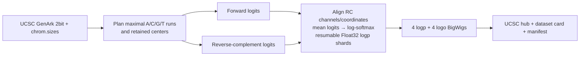

# Chinchilla m5.1 predictive sequence-logo pipeline

This experimental pipeline implements [issue #419](https://github.com/Open-Athena/marin-dna/issues/419): score the UCSC/NCBI RefSeq chinchilla assembly `GCF_000276665.1` with the public MarinDNA m5.1 checkpoint and build a native UCSC sequence-logo track. It is intentionally retained on its dedicated issue branch and is not planned for `main`.

The output is a **two-pass predictive sequence logo**. It is not an LLR logo, mutation-effect score, or constraint score. Every context window has exactly two logical model inputs: the forward reference sequence and its reverse complement.

## Pipeline



All genomic coordinates are 0-based, half-open. The default production proposal uses 255-bp contexts, a 128-bp stride, and window-relative retained interval `[63, 191)`. Adjacent regular retained centers abut. A tail context anchored at `run_end - 255` emits only positions not already emitted, so every planned scoreable base appears exactly once.

Only maximal case-insensitive A/C/G/T runs are tiled. Assembly gaps and other IUPAC bases are absent from the BigWigs. Runs shorter than 255 bp and the 63/64-bp context margins at scoreable-run boundaries are also absent, rather than represented by zero.

## Reproducible dry-run

Always dry-run before any real invocation:

```bash
uv run snakemake \
  --snakefile snakemake/analysis/chinchilla_logo/workflow/Snakefile \
  --directory snakemake/analysis/chinchilla_logo \
  --dry-run
```

The workflow-local default profile supplies `cores` and `use-conda`; do not duplicate those settings on the command line.

The default configuration selects only the largest scaffold, `NW_004955402.1`, for the Stage 2 benchmark. A real invocation downloads roughly 600 MB of UCSC 2bit sequence, expands the assembly to FASTA, and performs paid GPU inference. Obtain explicit approval before launching that work or any SkyPilot resource.

After approval, the complete configured target is:

```bash
uv run snakemake \
  --snakefile snakemake/analysis/chinchilla_logo/workflow/Snakefile \
  --directory snakemake/analysis/chinchilla_logo
```

### Stage 2 A10G benchmark

The checked-in SkyPilot task pins an on-demand AWS `g5.xlarge` (one A10G) in
`us-east-2` with a 250 GB disk. It records five-second GPU utilization/VRAM/power
samples, the cluster dry-run, `/usr/bin/time` process statistics, per-shard
inference timings, and BigWig construction time/file sizes.

Commit and push first so the manifest and dataset card can cite the exact code,
then launch from the repository root:

```bash
sky launch -c chinchilla-logo-a10g \
  snakemake/analysis/chinchilla_logo/sky/run_a10g.yaml \
  --env COMMIT_SHA=$(git rev-parse HEAD)
```

Watch the new configuration actively during startup and early inference:

```bash
sky logs chinchilla-logo-a10g --follow
sky exec chinchilla-logo-a10g nvidia-smi
```

The task intentionally leaves the cluster available so results can be copied
back before teardown. Retrieve `results/benchmark`, `results/plans`,
`results/shards`, and `results/release`, verify them locally, then explicitly
terminate the cluster to stop compute charges.


## Resumption and bounded memory

`score_scaffold` loads the pinned model once for a scaffold, then invokes the existing Hugging Face `Trainer.predict` harness on fixed-size window chunks. The harness pads the last physical batch and removes padded predictions, preserving one static compiled shape.

Each completed chunk is written immediately under `results/shards/<scaffold>/part-*.npz`. The Snakemake output is a separate `.done.json` marker, so an interrupted rule retains validated chunks. On retry, shard coordinates and output-affecting metadata must exactly match the current plan before the chunk is skipped.

Shards store canonical Float32 log-probabilities plus window/emit offsets. Logo heights are deterministically reconstructed from `logp`, avoiding duplicate intermediate storage while preserving enough information to audit the exact context responsible for every published base.

## Outputs

```text
results/release/
├── README.md
├── bigwig/
│   ├── logprob/{A,C,G,T}.bw
│   └── logo/{A,C,G,T}.bw
├── manifest/release.json
└── ucsc/
    ├── hub.txt
    ├── genomes.txt
    └── GCF_000276665.1/trackDb.txt
```

The logo composite is visible by default with a fixed 0–2-bit range and UCSC `logo on`; the log-probability multiWig is hidden by default. Missing positions are absent intervals. The BigWig headers use the complete UCSC `chrom.sizes` inventory even when the configured scoring scope is a subset of scaffolds.

The release manifest records the model repository and immutable revision, application commit, UCSC chrom-sizes checksum, exact coverage reconciliation, runtime settings, throughput, GPU/peak VRAM, Float32/no-rounding policy, and SHA-256/byte size for each release file.

## Publication boundary

There is deliberately no Hugging Face upload rule. The generated dataset card contains a commit-pinned pipeline permalink and the required `biology`, `genomics`, and `dna` tags, but it must be reviewed by a human before any upload. After upload, separately validate HTTP range requests, sampled Float32 round trips, logo reconstruction from log-probability BigWigs, UCSC rendering at several zoom levels, missing-data behavior, and a signed-out share URL. Record those results in issue #419, not this README.

## Tests

The implementation is exercised by:

```bash
uv run pytest tests/model/test_sequence_interpretation.py \
  tests/pipelines/test_chinchilla_logo.py
```

The tests cover the issue #387 single-sequence definition, forward/RC coordinate and channel mapping, logit-before-softmax averaging, numerical invariants, canonical-run/gap/tail tiling, exact-once emission, resumable shard round trips, missing BigWig intervals, track-hub defaults, and the commit-pinned dataset-card contract.
